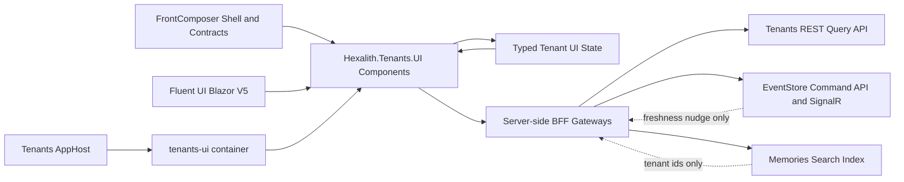
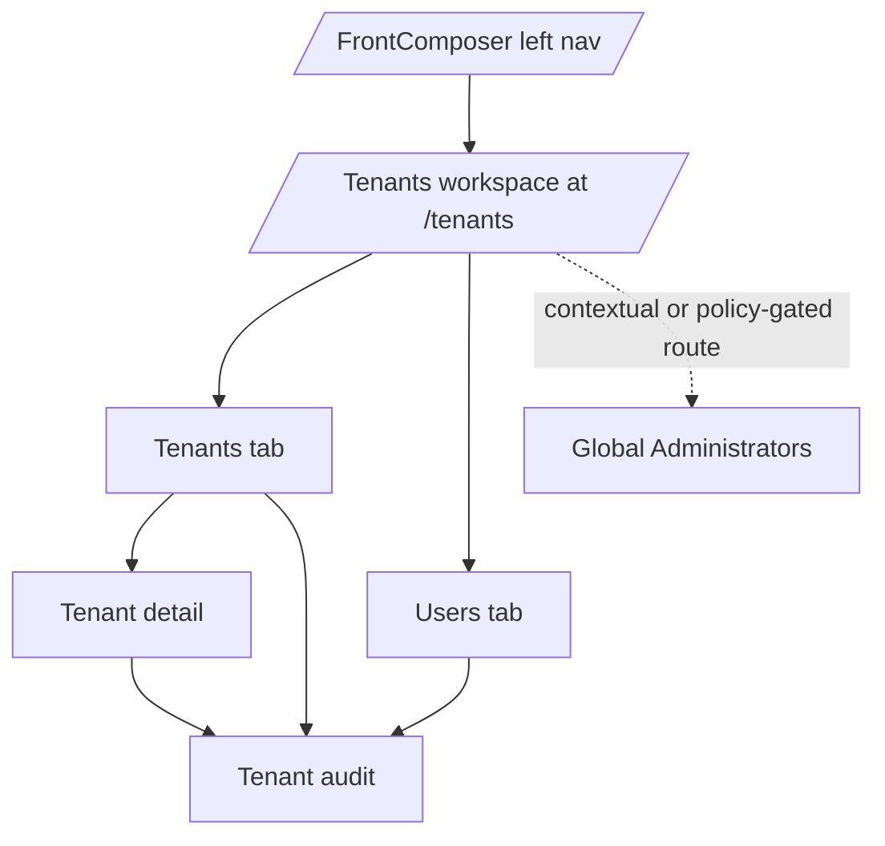

# Architecture Spine - Tenants FrontComposer Composition

## Design Paradigm

Tenants Management UI is a **FrontComposer-composed domain UI**: FrontComposer owns shell, page chrome, domain registration, and reusable UI primitives; Tenants owns the tenant-domain surfaces, domain state vocabulary, server-side gateway composition, and support-safe user-facing domain copy.

The event-sourced Tenants backend is inherited context. The composition spine governs how the UI surfaces bind to that context without turning Tenants into a bespoke app or a duplicate FrontComposer module.

## Inherited Context

| Context | Source | Binds here |
| --- | --- | --- |
| Event-sourced Tenants domain with immutable corrections and projection reads | Tenants project context, contracts, and server code | Query, command, audit, and recovery surfaces |
| Blazor InteractiveServer plus server-side BFF | `src/Hexalith.Tenants.UI/Program.cs` | Browser/backend boundary, token handling, gateway composition |
| Direct Tenants REST reads with projection freshness metadata | `src/Hexalith.Tenants/Queries`, `src/Hexalith.Tenants.UI/Services/Gateways` | List, detail, member, user, audit, global-administrator surfaces |
| FrontComposer and Fluent UI V5 are mandatory UI sources | Hexalith UX instructions and FrontComposer project context | All module UI components, layout, styling, conformance tests |

## Invariants & Rules

### AD-1 - Tenants Is One FrontComposer Module Entry [ADOPTED]

- **Binds:** FR-1..FR-4, FR-18..FR-21, Operations Shell IA.
- **Prevents:** independently-built surfaces registering separate shell entries for All Tenants, My Tenants, Users, Global Administrators, or Audit.
- **Rule:** Tenants contributes exactly one shell navigation entry at `/tenants`; Tenants-domain sub-surfaces live as page-local tabs, scope modes, aliases, or contextual links inside the module workspace.

### AD-2 - Page-Local Tabs Own Tenants Sub-Surface Switching [ADOPTED]

- **Binds:** `/tenants`, `/tenants/my`, `/tenants/users`, tenant detail and audit return flows.
- **Prevents:** shell navigation, route aliases, and return links from encoding incompatible information architecture.
- **Rule:** `/tenants` defaults to the Tenants tab; the Users tab is lookup-backed by `GET /api/users/{userId}/tenants` and must not claim complete all-users inventory; old routes remain aliases or canonical links into the workspace.

### AD-3 - FrontComposer And Fluent Are The First UI Composition Surface [ADOPTED]

- **Binds:** all Razor components, UX-DR1..UX-DR33, Fluent conformance tests.
- **Prevents:** raw interactive controls, duplicate page chrome, theme redefinition, and Tenants-owned generic UI infrastructure.
- **Rule:** use FrontComposer or Fluent UI Blazor V5 components before custom markup; custom CSS or raw semantic markup is allowed only for documented gaps not covered by FrontComposer or Fluent.

### AD-4 - Tenants Owns Domain Composition, Not Generic UI Infrastructure [ADOPTED]

- **Binds:** `Components/Tenants`, `Components/Users`, `State`, `Services`, `Resources`.
- **Prevents:** generic grids, tabs, shell layout, theme primitives, or reusable command chrome being implemented inside Tenants.
- **Rule:** Tenants-specific components may encode tenant safety, freshness, audit, support-safety, and command behavior; reusable UI capability is a FrontComposer change or an approved fallback.

### AD-5 - Server-Side Gateways Are The Only Backend Egress [ADOPTED]

- **Binds:** query surfaces, command flows, auth token relay, Memories search hydration.
- **Prevents:** browser-side backend calls, token exposure, component-to-HTTP coupling, and multiple transport paths for the same data.
- **Rule:** UI components never call Tenants, EventStore, or Memories directly; backend egress goes through `ITenantQueryGateway`, `ITenantCommandGateway`, and their server-side collaborators.

### AD-6 - Direct Tenants REST Reads Are The Read Transport [ADOPTED]

- **Binds:** FR-1..FR-9, FR-18, FR-20..FR-23, NFR-1, NFR-3.
- **Prevents:** routing tenant reads through the EventStore generic query gateway or retired projection-actor paths that drop projection metadata.
- **Rule:** read composition calls direct Tenants REST endpoints through the BFF and preserves ETag, cursor, authorization, and read-model freshness metadata.

### AD-7 - Projection-Confirmed Truth Is Shared Composition State [ADOPTED]

- **Binds:** truth badges, command lifecycle panels, list/detail/member/audit/global-administrator surfaces, command flows.
- **Prevents:** optimistic success, per-surface state vocabularies, and collapsing `accepted`, `confirmed`, and `audit available`.
- **Rule:** every actionable surface renders from typed shared truth/freshness/lifecycle/audit/authorization state; SignalR and command status are nudges until an authoritative projection re-query confirms.

### AD-8 - Freshness Comes From EventStore Read-Model Metadata [ADOPTED]

- **Binds:** action availability, list states, badges, stale/degraded behavior.
- **Prevents:** duplicate Tenants freshness enums, `ServedAt` as projection age, search results as freshness proof, or 304 responses being treated as recovery without metadata.
- **Rule:** Tenants UI uses `ReadModelFreshnessState`; `Refreshing` is client-transient; stale or unknown data fails closed where the safety contract requires it.

### AD-9 - Domain Copy And Support Safety Stay Tenants-Owned [ADOPTED]

- **Binds:** receipts, consequence previews, rejection text, copy actions, resource files.
- **Prevents:** shell-owned domain wording, fragment-assembled localization, and unsafe data leaking into rendered output.
- **Rule:** domain-facing text uses Tenants-owned whole-string resources; the BFF assembles and redacts receipts, previews, and rejection text before anything reaches the DOM.

### AD-10 - Memories Is Search-As-Index-Only [ADOPTED]

- **Binds:** FR-1 cross-set tenant search and tenant list search states.
- **Prevents:** adding a Tenants/EventStore list-filter endpoint, rendering row truth from Memories, or blocking the tenant list on search outage.
- **Rule:** Memories returns tenant ids from `tenants-index`; the BFF hydrates rows through the authoritative Tenants read path and degrades to the cursor list when Memories is unavailable.

### AD-11 - UI Conformance Tests Are Architectural Guardrails [ADOPTED]

- **Binds:** UI tests, route smoke tests, localization parity, selector stability, support safety.
- **Prevents:** accidental drift from FrontComposer/Fluent composition, raw controls, unsupported routes, or unsafe rendered output.
- **Rule:** every UI surface change updates focused bUnit/conformance coverage; guards are not loosened without an explicit approved story.

### AD-12 - Command Flows Share One FrontComposer Command Posture [ADOPTED]

- **Binds:** FR-10..FR-17, FR-19, FR-24..FR-25, CP-2..CP-8.
- **Prevents:** independent command flows choosing optimistic success, concurrent submits, bulk action, toast batching, or bypassing preview/gating.
- **Rule:** command UX composes the shared gateway/lifecycle pattern, consequence preview where required, projection re-query confirmation, and the approved one-at-a-time concurrency fallback until a stronger FrontComposer command contract replaces it.

### AD-13 - The UI Host Is A Domain Presentation Host [ADOPTED]

- **Binds:** deployment, local orchestration, auth/service references, containerization.
- **Prevents:** moving Tenants domain UI into FrontComposer, shipping it as a NuGet package, adding Dockerfiles, or duplicating shared hosting/ServiceDefaults infrastructure.
- **Rule:** `src/Hexalith.Tenants.UI` is a publishable app/container owned by this repository and wired by `src/Hexalith.Tenants.AppHost`; shared platform hosting capability stays in shared Hexalith modules.



## Consistency Conventions

| Concern | Convention |
| --- | --- |
| Navigation | One shell entry: `/tenants`; page-local tabs and contextual routes own all Tenants sub-surfaces. |
| Components | Surface components live under `Components/Tenants`, `Components/Users`, `Components/Pages`, or `Components/Shared`; generic UI capability belongs in FrontComposer. |
| Backend access | Components use composed panels and gateways, never direct HTTP clients; `ITenantQueryGateway` and `ITenantCommandGateway` are the trust boundary. |
| Data identity | `TenantId` and `UserId` are meaningful caller-supplied strings; never parse them as GUIDs or ULIDs. |
| Freshness | `ReadModelFreshnessState` is the shared persisted classification; `Refreshing` is a transient view flag. |
| Search | Memories supplies tenant id match sets only; hydrated Tenants reads supply row data and truth state. |
| Localization | Tenants domain copy uses `TenantsResources` whole strings with EN/FR parity; shell chrome may inherit FrontComposer resources. |
| Styling | Fluent semantic roles, Fluent layout components, and Fluent 2 tokens only; no local theme redefinition or legacy Fluent v4/FAST tokens. |
| Support safety | Rendered output and copy actions never expose payloads, bearer tokens, decoded JWTs, raw metadata, ETags, cursors, correlation ids, stack traces, or PII. |
| Testing | bUnit and conformance tests lock navigation, Fluent usage, resource parity, selectors, support safety, and route aliases. |
| Commands | Command flows use one-at-a-time submission, shared lifecycle wording, preview where required, status polling plus projection re-query, and no optimistic success. |
| Deployment | The UI host is an app/container wired by the repo AppHost; it is not a NuGet package and does not own generic hosting infrastructure. |

## Stack

| Name | Version |
| --- | --- |
| .NET SDK | 10.0.301 |
| Blazor render mode | InteractiveServer on ASP.NET Core 10 |
| Microsoft.FluentUI.AspNetCore.Components | 5.0.0-rc.3-26138.1 |
| Hexalith.FrontComposer | source submodule e2ac85aac67d |
| Hexalith.EventStore source | source submodule 60e63a95bed8 |
| Hexalith.EventStore package fallback | 3.19.0 |
| Hexalith.Memories source | source submodule 24757db93c90 |
| Hexalith.Memories package fallback | 1.31.1 |
| Dapr packages | 1.18.4 |
| Aspire packages | 13.4.6 |
| xUnit v3 | 3.2.2 |
| bUnit | 2.8.4-preview |

## Structural Seed

```text
src/Hexalith.Tenants.UI/
  Composition/                 # FrontComposer domain manifest and nav registration
  Components/Pages/            # route-level workspace and contextual pages
  Components/Tenants/          # tenant-domain surfaces and command flows
  Components/Users/            # self-audit and user-membership lookup surfaces
  Components/Shared/           # tenant-domain reusable view atoms
  Services/Gateways/           # only backend egress from the UI host
  Services/SupportSafety/      # redaction and safe-copy classification
  State/                       # typed runtime UI state per surface
  Resources/                   # Tenants-owned localized domain copy
src/Hexalith.Tenants.AppHost/
  HexalithTenantsUI.cs          # local orchestration metadata for the UI host
tests/Hexalith.Tenants.UI.Tests/
  Components/                  # bUnit surface coverage
  Services/                    # gateway/support-safety coverage
  State/                       # typed state and behavior coverage
```



## Capability -> Architecture Map

| Capability / Area | Lives in | Governed by |
| --- | --- | --- |
| FR-1 tenant list triage and search | `TenantsWorkspace`, `TenantDataGrid`, `TenantQueryGateway` | AD-1, AD-3, AD-5, AD-6, AD-8, AD-10 |
| FR-2 tenant detail navigation | `TenantDetailPage`, `TenantListNavigationContext` | AD-1, AD-2, AD-5, AD-6 |
| FR-3 my tenants | Tenants tab scope mode and `MyTenantsPanel` | AD-1, AD-2, AD-5, AD-6 |
| FR-4 user lookup | Users tab and `UserMembershipLookupPanel` | AD-1, AD-2, AD-5, AD-6 |
| FR-5..FR-9 read-only tenant detail, config, members, action reasons | `Components/Tenants`, shared badges/reasons | AD-3, AD-4, AD-7, AD-8, AD-9 |
| FR-10..FR-17 tenant command flows | `Components/Tenants/*Flow`, `ITenantCommandGateway` | AD-5, AD-7, AD-8, AD-9, AD-12 |
| FR-18..FR-19 global administrators | `GlobalAdministratorsPage`, global-admin state/models | AD-1, AD-5, AD-7, AD-9, AD-12 |
| FR-20..FR-23 audit evidence | `TenantAuditPage`, `AuditDataGrid`, `AuditEvidenceReceipt` | AD-1, AD-3, AD-5, AD-7, AD-9 |
| FR-24..FR-25 compensating recovery | audit correction components and command gateway | AD-5, AD-7, AD-9, AD-12 |
| NFR-6, NFR-7, NFR-8, NFR-9 evidence | UI conformance tests and route smoke tests | AD-3, AD-9, AD-11 |
| UI host deployment and local orchestration | `Hexalith.Tenants.UI`, `Hexalith.Tenants.AppHost` | AD-13 |

## Deferred

| Deferred item | Revisit condition |
| --- | --- |
| Complete all-users inventory | Product/API approves and implements an authorization-scoped backend read query. |
| Shared FrontComposer replacements for approved fallbacks | FrontComposer ships reusable equivalents for audit timeline, consequence preview, or command concurrency contracts. |
| Freshness `aging` over the wire | EventStore exposes `ProjectedAt` or equivalent metadata in `QueryResponseMetadata`. |
| Multi-replica cursor durability | Backend shared DataProtection key-ring or cursor durability work lands. |
| RTL verification and WCAG 2.2 claim | Product promotes it into release scope and pinned Fluent/FrontComposer behavior is verified. |
| Sensitive configuration display | Product/security defines the masking, reveal, and audit policy. |
