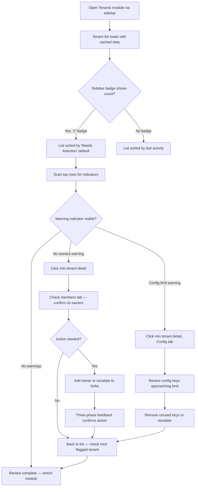
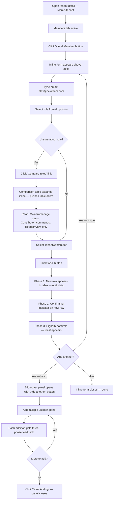
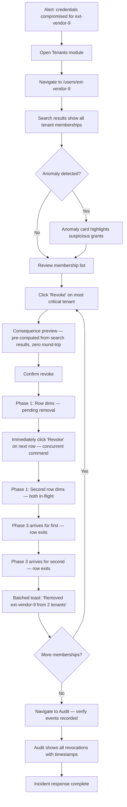
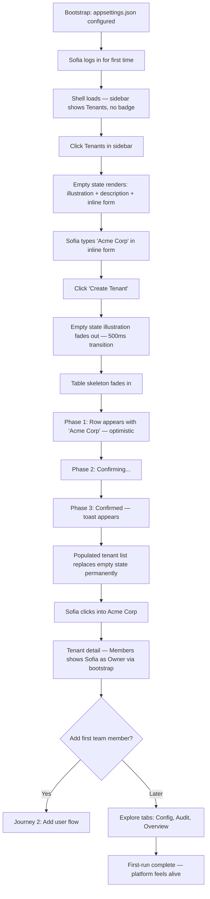
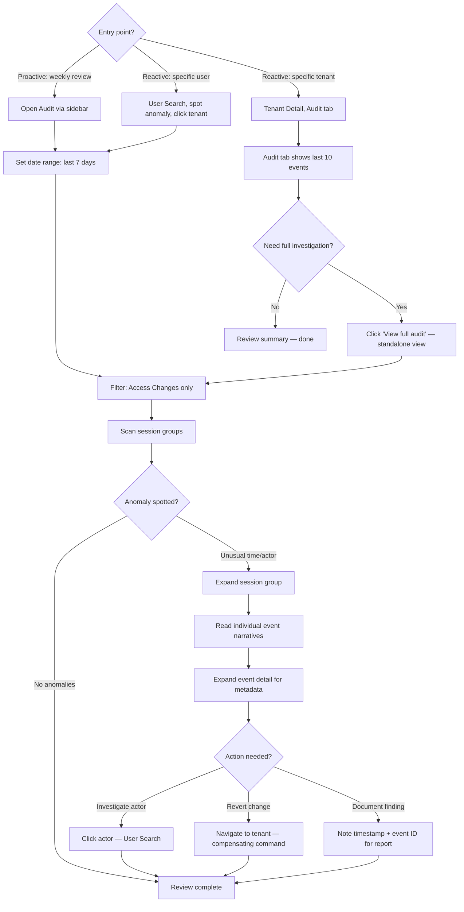
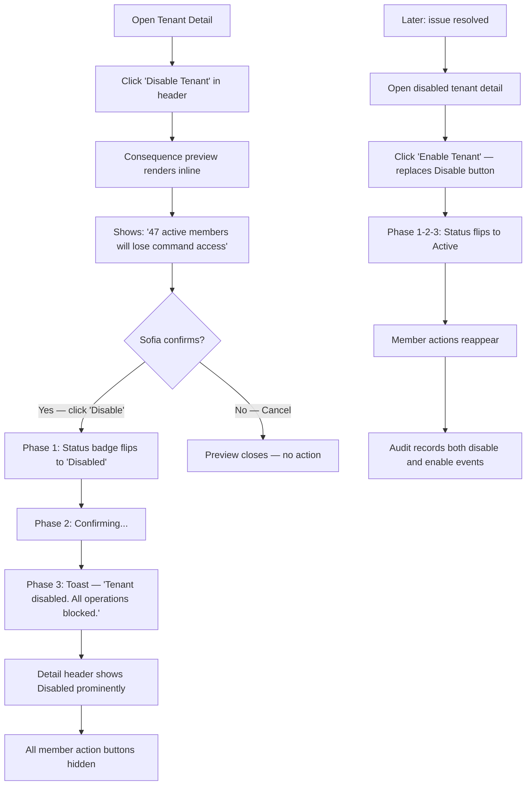
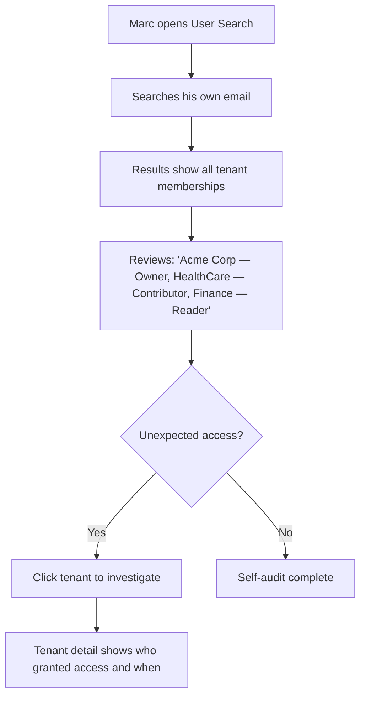

# UX Design Specification Hexalith.Tenants

**Author:** Jerome
**Date:** 2026-03-24

---

## Executive Summary

### Project Vision

Hexalith.Tenants UI is a production admin interface and the reference module for Hexalith.FrontShell — a full-lifecycle tenant management application that simultaneously validates FrontShell's design system, CQRS hooks, and component library. It provides multi-tenant lifecycle management, user-role administration, tenant configuration, and temporal audit capabilities through an event-sourced backend consumed via FrontShell's `useCommand` and `useProjection` hooks.

As the reference module, every screen, component composition, and interaction pattern serves as the canonical template for all future FrontShell modules. The UX must exemplify FrontShell's design principles: beautiful by default, invisible architecture, progressive revelation, designed degradation, and consistency as freedom. Developers building future modules will read this module's source code to learn FrontShell patterns — code readability and pattern clarity are first-class UX concerns.

The design inherits and builds upon the FrontShell UX Design Specification's design system (`@hexalith/ui`), emotional design goals (visual coherence, causal clarity, signal clarity), and component library (Radix Primitives + custom design tokens). This document focuses on Tenants-specific screens, flows, interactions, and domain UX patterns.

### Target Users

| Persona | Role | Primary Interaction | Design Priority |
|---------|------|-------------------|-----------------|
| **Elena** (Operations) | Daily operator managing tenants | Tenant list, user management, status monitoring | Information density, scan speed, keyboard efficiency |
| **Sofia** (Global Administrator) | Platform-wide admin | Cross-tenant operations, audit review, tenant lifecycle | Cross-tenant navigation, temporal audit UX, bulk operations |
| **Marc** (Tenant Owner) | Manages their own tenant(s) | Add/remove users, change roles, manage configuration | Focused single-tenant view, clear role hierarchy |
| **Lucas** (Module Developer) | Reads Tenants source as reference | Studies code patterns, copies interaction models | Code readability, pattern clarity, canonical examples |

### Screen Inventory

Nine core screens/views mapped to backend command and query surfaces:

| Screen | Purpose | Backend Surface | FrontShell Components Exercised |
|--------|---------|----------------|-------------------------------|
| **Tenant List** | Filterable, sortable table with status indicators | `ListTenantsQuery` (FR25, FR30) | `<Table>`, `<EmptyState>`, `<LoadingState>` |
| **Tenant Detail** | Tabbed/sectioned view: overview, members, config, audit | `GetTenantQuery` (FR26) | `<DetailView>`, `<Tabs>` |
| **Create Tenant** | Slide-over panel form | `CreateTenant` command (FR1) | `<Form>`, `<Toast>` |
| **Edit Tenant** | Metadata update (name, description) | `UpdateTenant` command (FR2) | `<Form>` inline or panel |
| **User Management** | Add/remove users, change roles within a tenant | `AddUserToTenant`, `RemoveUserFromTenant`, `ChangeUserRole` (FR6-8) + `GetTenantUsersQuery` (FR27) | `<Table>`, `<Select>`, `<Modal>` (destructive), `<Toast>` |
| **Tenant Configuration** | Namespace-grouped key-value editor | `SetTenantConfiguration`, `RemoveTenantConfiguration` (FR19-20) | `<Form>`, `<Table>`, `<DetailView>` |
| **Audit Trail** | Temporal event view with date range filtering | `GetTenantAuditQuery` (FR29) | `<Table>`, `<Form>` (filters) |
| **My Tenants** | User's own tenant memberships and roles | `GetUserTenantsQuery` (FR28) | `<Table>` |
| **Global Admin Management** | Set/remove global administrators | `SetGlobalAdministrator`, `RemoveGlobalAdministrator` (FR13-14) | `<Table>`, `<Modal>` (destructive), `<Toast>` |

### Key Design Challenges

1. **Role-aware information hierarchy** — The same screens serve four authorization levels (TenantReader, TenantContributor, TenantOwner, GlobalAdmin), but these aren't the same screen with fewer buttons — they represent different mental models. A TenantReader scanning a user list asks "who's here?" A TenantOwner scanning the same list asks "who should I add or remove?" The information hierarchy, affordances, and emphasis must shift based on the user's role and intent without feeling stripped-down or overwhelming.

2. **Cross-tenant navigation model** — GlobalAdmin operates under the `system` platform tenant context, *managing* other tenants. The UI must distinguish between "my operational context" (always `system` for this module) and "the tenant I'm currently inspecting." Regular users see only their assigned tenants. The shell's tenant context, the tenant list, and the detail view must work coherently for both modes — this is architecturally unique to the Tenants module.

3. **CQRS eventual consistency interactions** — The three-phase feedback pattern (optimistic → confirming → confirmed) must be demonstrated as the canonical reference implementation. Additionally, the architecture specifies a concrete read-after-write mitigation: after `CreateTenant`, the command response includes the aggregate ID, and the client navigates directly to the detail view. If the projection hasn't processed yet, the UI shows "processing..." with a short poll. This must be an explicit, reusable interaction pattern, not just a general "CQRS challenge."

4. **Query-command asymmetry** — Most screens are read-heavy with occasional writes. Elena browses the tenant list 50 times for every tenant she creates. The UX must optimize for the read path — fast table rendering, projection caching, SignalR live updates — with the command path as a secondary flow triggered from the read view. This is a concrete CQRS design principle that shapes layout, navigation, and interaction priorities.

5. **Temporal audit trail UX** — The product's key differentiator ("who had access last Tuesday?") requires making event-sourced audit data scannable and actionable, not just a raw event log. No competing multi-tenant tool offers this capability, so there's no established UX pattern to follow.

6. **Empty state storytelling** — As the reference module, the very first thing anyone sees is an empty Tenants screen with no tenants. That empty state IS the first impression of FrontShell. It must be extraordinary — anticipatory, domain-aware, and a showcase for the `<EmptyState>` component pattern.

7. **Bootstrap and first-run UX** — On first deployment, there are zero global administrators. The bootstrap mechanism creates the initial admin via `appsettings.json` config. The UI must handle the post-bootstrap state gracefully — the transition from "system just started" to "first tenant created" is a critical onboarding moment.

8. **Reference module exemplar pressure** — Every pattern will be studied and copied by future module developers (Lucas). Each component composition, empty state, error handling, loading skeleton, and role-based adaptation must be canonical — simultaneously great for end users AND clear as a learning template.

### Design Opportunities

1. **Reusable UX pattern extraction** — The Tenants module should establish ecosystem-wide patterns that other modules adopt as templates: role-based UI adaptation pattern, CQRS three-phase feedback implementation, audit trail component pattern, configuration editor pattern, empty state with domain context pattern. These aren't just screens — they're templates for the FrontShell ecosystem.

2. **Temporal audit as competitive screenshot** — A well-designed audit timeline answering "who had access last Tuesday?" creates visual proof that CRUD-based tools cannot match. This is the product's strongest differentiator, and a polished audit view could become the screenshot that sells the platform.

3. **Real-time projection feedback** — Every command produces visible, immediate feedback via SignalR. The Tenants module demonstrates this pattern in the most convincing way possible — user removal reflecting instantly across the UI, configuration changes propagating visually. The "aha moment" demo is a byproduct of great real-time UX, not a separate feature.

4. **Configuration namespace visualization** — Grouped/tree view of dot-delimited configuration namespaces (`billing.plan`, `parties.maxContacts`) transforms flat key-value into organized, discoverable settings — a pattern no competing tool provides.

5. **Role hierarchy visualization** — Clear visual representation of TenantOwner > TenantContributor > TenantReader capabilities, making abstract authorization tangible and learnable.

### Emotional Register Mapping

Each screen operates at a default emotional register (per FrontShell's four-register system) with defined shift triggers:

| Screen | Default Register | Shift Trigger |
|--------|-----------------|---------------|
| Tenant List | **Quiet** (browsing, scanning) | → **Assertive** when a disabled tenant is spotted |
| Tenant Detail | **Neutral** (active inspection) | → **Urgent** if tenant shows anomalous activity |
| Create Tenant | **Neutral** (administrative action) | → **Assertive** on successful creation |
| User Management | **Neutral** (routine admin) | → **Urgent** during incident response (Sofia's 11 PM scenario) |
| Tenant Configuration | **Quiet** (low-frequency settings) | → **Assertive** on save confirmation |
| Audit Trail | **Quiet** (review mode) | → **Urgent** when anomaly detected |
| User Search | **Quiet** (personal overview) or **Urgent** (incident response) | Context-dependent on arrival intent |
| Global Admin Management | **Assertive** (high-stakes by nature) | Always elevated — modifies platform-level access |

## Core User Experience

### Defining Experience

The Tenants module's core experience is the **tenant member table — scan, find, act** loop. Elena opens a tenant, scans the member list, identifies who needs attention, and acts: add a user, change a role, remove access. This loop constitutes 80%+ of daily interaction with the module.

The core loop:
```
Tenant List → select tenant → Member Table → scan/filter → act (add/remove/change role) → see feedback → back to table
```

This loop is supported by two complementary experiences:
- **CQRS feedback loop** (trust mechanism): every command produces immediate three-phase visual feedback (optimistic → confirming → confirmed via SignalR), with defined degradation patterns for connection issues and concurrency conflicts.
- **Audit trail** (differentiator): temporal event history answering "who changed what and when," presented as grouped-by-session narratives. Available as a summary banner within tenant detail and as a dedicated full-screen view for deep investigation.

### Core Workflows

The module serves three distinct workflows, each anchored to a persona and a primary view:

| Workflow | Persona | Flow | Primary View |
|----------|---------|------|-------------|
| **Tenant management** | Elena, Marc | List → detail → act → feedback → back to list | Tenant list (smart dashboard table) |
| **Incident response** | Sofia | Search user → find memberships → revoke → verify propagation | User search → tenant detail |
| **Audit investigation** | Sofia | Filter events → scan timeline → drill into session → correlate | Audit view (standalone or contextual) |

### Revised Screen Inventory

Refined from the original 9 screens — inline editing eliminates Edit Tenant as a standalone screen:

| Screen | Purpose | Backend Surface | Priority |
|--------|---------|----------------|----------|
| **Tenant List** | Smart dashboard table with health indicators, filter bar | `ListTenantsQuery` (FR25, FR30) | Must-ship |
| **Tenant Detail** | Tabbed view: overview (with inline metadata editing + recent changes banner), members, configuration, audit summary | `GetTenantQuery` (FR26) | Must-ship |
| **Create Tenant** | Slide-over panel form; combined with empty state for first-run | `CreateTenant` command (FR1) | Must-ship |
| **User Management** | Tab within tenant detail: add/remove users, change roles with inline role explanation | `AddUserToTenant`, `RemoveUserFromTenant`, `ChangeUserRole` (FR6-8) + `GetTenantUsersQuery` (FR27) | Must-ship |
| **User Search** | Cross-tenant user lookup: all memberships for a given user ID. Serves both Sofia's incident response AND Marc's self-audit (viewing own memberships) | `GetUserTenantsQuery` (FR28) | Must-ship |
| **Tenant Configuration** | Tab within tenant detail: namespace-grouped key-value editor | `SetTenantConfiguration`, `RemoveTenantConfiguration` (FR19-20) | Can-follow |
| **Audit Trail** | Standalone full-screen view: flat timeline in MVP (grouped-by-session as fast follow), date range filtering, bidirectional navigation (tenant→audit AND audit→tenant) | `GetTenantAuditQuery` (FR29) | Must-ship (flat timeline); fast-follow (grouped-by-session) |
| **Global Admin Management** | Dedicated view: set/remove global administrators | `SetGlobalAdministrator`, `RemoveGlobalAdministrator` (FR13-14) | Must-ship |

**Sidebar entries:** The module registers three sidebar entries under a shared manifest `category` to group them together, avoiding an empty-shell feeling during FrontShell's early life:

```typescript
navigationItems: [
  { label: 'Tenants', path: '/tenants', icon: 'building', category: 'tenant-management' },
  { label: 'Audit', path: '/tenants/audit', icon: 'shield', category: 'tenant-management' },
  { label: 'Administration', path: '/admin', icon: 'settings', category: 'tenant-management' },
]
```

### Platform Strategy

Platform decisions inherited from FrontShell, with Tenants-specific considerations:

| Dimension | Decision | Rationale |
|-----------|----------|-----------|
| Platform | Web SPA within FrontShell shell | Inherited — module within the shell |
| Input mode | Mouse/keyboard primary, desktop-first | Inherited — enterprise operations workstation |
| Navigation entry | Sidebar module entries → tenant list as default landing page | Context-aware: Sofia arriving from user search lands on search results, Marc from deep link lands on tenant detail |
| Tenant context | Module always operates under `system` platform tenant; "current tenant" refers to the managed tenant being inspected | Architectural constraint — Tenants service runs in `system` context |
| Deep linking | `/tenants` (list), `/tenants/{id}` (detail), `/tenants/{id}/audit` (audit), `/admin` (global admin), `/users/{id}` (user search) | Every view is shareable via URL |
| URL-encoded filter state | Table filters sync bidirectionally with URL params: `/tenants?status=disabled&sort=lastActivity:desc&hasWarnings=true` | Elena can bookmark "show me problems" as a one-click shortcut; shared links preserve filter context |
| Real-time | SignalR projection updates for tenant list and detail views; automatic polling fallback (5s) for restricted networks | Tenant changes by other admins appear in real-time |
| Pagination | Cursor-based per FR30. Default page sizes: 25 for member table (500 users max), 50 for tenant list (1000 tenants max). Filter param shape: `?status=active&search=acme&sort=name:asc&cursor=xxx` | Server-side mode mandatory from day one to prevent scaling wall |
| Tenant list filtering | Status filter, warning filter, text search in filter bar | Essential at 500+ tenants; Sofia can't click into each one |
| Command palette | Module registers Ctrl+K entries in manifest for Phase 1.5 activation | Future keyboard efficiency; design for it now, enable later |
| Freshness context | Dashboard indicators show "as of..." freshness timestamp | Honest about eventual consistency; no false real-time assumptions |
| Offline | Not applicable — CQRS commands require backend connectivity | Inherited from FrontShell |

### Effortless Interactions

#### Must-Ship (MVP)

**1. Role-transparent actions**
Marc opens a tenant he owns. Action buttons (Add User, Set Config) are naturally present. He switches to a tenant where he's a Reader — the same layout, but action buttons are absent. No "permission denied" dialogs, no disabled buttons. The UI *is* the permission model. Role-based adaptation happens at the view level (within tenant detail), not at the list level (which shows the same columns for all roles).

**2. Inline user role management**
Adding a user to a tenant: a row-level action opens an inline form — type email/user ID, select role from three options, confirm. The new user appears immediately (optimistic). No page navigation, no context loss.

**3. Instant tenant status feedback**
When Sofia disables a tenant, the status badge flips immediately (optimistic), the confirming indicator shows briefly, and the confirmed state resolves via SignalR. The entire row shifts to muted visual treatment — emotional register shifts from neutral to assertive.

**4. Tenant list as smart dashboard**
The tenant list surfaces problems without requiring drill-down. Six projection-derivable indicators:

| Indicator | Data Source | Client Derivation |
|-----------|-----------|-------------------|
| Status badge (Active/Disabled) | Projection field | Direct |
| Member count | Projection field | Direct |
| Last activity timestamp | Projection field | Direct |
| "Recent change" highlight | Last activity < 24h | Client-side |
| Config key count / limit proximity | Projection field | Client-side |
| No owners warning | Members with TenantOwner role = 0 | Client-side |

**5. Three-phase command feedback (reference implementation)**
Every command demonstrates the canonical FrontShell pattern:
- **Phase 1 (Optimistic):** Client-predictable fields update instantly
- **Phase 2 (Confirming):** Subtle animated underline on affected row; micro-indicator for 0-2s
- **Phase 3 (Confirmed):** SignalR projection update resolves final values; toast confirms

Server-calculated fields show skeleton placeholders in Phase 1 instead of wrong optimistic values.

**6. User-centric cross-tenant search**
Sofia's incident response starts with a user, not a tenant. A search feature accepts a user ID and returns all tenant memberships with roles — answering "where does this user have access?" in one query via `GetUserTenantsQuery` (FR28). Marc can also search himself for a self-audit of his own memberships.

**7. Zero-config tenant list**
First visit shows all accessible tenants with sensible default columns (Name, Status, Role, Member Count). Sort, filter, and search present in toolbar from the start. Column preferences persist once customized.

#### Should-Ship (MVP if time permits)

**8. Role explanation at point of selection**
When selecting a role for a new user, an expandable inline comparison shows capabilities per role. No tooltip — an inline expansion within the role selector.

**9. Consequence preview for impact commands**
Before confirming DisableTenant, RemoveUserFromTenant, or other high-impact commands, an inline preview panel shows the impact: "This will disable access for 5 active users" or "This user is the last TenantOwner." Not a confirmation dialog — an informational panel before commit.

**10. Recent changes summary in detail view**
Tenant detail opens with a "Recent Activity" banner above tabs — "2 members added in the last 24 hours by Jerome" — giving immediate context before any tab is selected.

#### Can-Follow (Post-MVP)

**11. Audit trail as grouped-by-session narrative**
Audit events grouped by actor + 30-minute time window: "Jerome's session at 2 PM: added 3 users, changed 1 config key." Expandable detail per event. Supports both tenant→audit and audit→tenant navigation directions.

**12. Configuration as organized namespace tree**
Keys grouped by namespace prefix (`billing.*`, `parties.*`), with collapsible sections. Adding a new key auto-suggests existing namespace prefixes.

**13. Combined empty state + create form**
When the tenant list is empty, the empty state IS the create form — "Name your first tenant:" with an inline input. After creation, subsequent tenants use the standard slide-over.

**14. Inline metadata editing**
Tenant name and description editable inline on the detail view — click, edit in place, press Enter. No separate form.

### Degradation Patterns

Every failure scenario has an explicit, tested UX response:

| Scenario | User Sees | Timing | Validation Method |
|----------|----------|--------|-------------------|
| **SignalR down during command** | Optimistic → "Verifying..." (5s) → amber banner (15s) → batch resolve on reconnect | 5s / 15s thresholds (tune from actual DAPR SignalR reconnection data) | Integration test: disconnect SignalR mid-command, verify escalation sequence |
| **Projection lag after create** | Skeleton + "Setting up..." poll → warning at 10s → timeout message at 30s | 500ms poll, 10s warning, 30s timeout | Integration test: delay projection processing, verify poll + timeout UX |
| **Concurrency rejection** | Specific toast ("Modified by another admin") + auto-refresh via SignalR | Immediate | Playwright CT: two sessions, concurrent modification, verify toast + refresh |
| **Stale cache + command rejection** | Specific rejection toast + auto-refresh | Immediate | Integration test: stale cache scenario, verify rejection toast specificity |
| **Batch projection updates** | Single table re-render, not individual row animations | 100ms batch window | Performance test: 10 concurrent updates, verify single re-render |

### Critical Success Moments

| Moment | Persona | What Happens | Why It Matters | Validation Method |
|--------|---------|-------------|----------------|-------------------|
| **First empty state** | Any user | Opens Tenants module — no tenants exist. Empty state invites creation. | First impression of FrontShell. | Playwright CT: verify empty state renders with CTA, click CTA opens create form |
| **First tenant created** | Sofia/Marc | Creates first tenant, sees it appear via three-phase feedback | Platform trust begins. | Playwright CT: create tenant → three-phase feedback visible → tenant appears in list within 5s |
| **First user added** | Marc | Adds a team member inline — appears in table instantly | Core loop works. | Playwright CT: add user inline → optimistic row appears → confirm resolves |
| **First role adaptation** | Marc | Switches from owned tenant to read-only tenant — actions disappear naturally | UI IS the permission model. | Playwright CT: login as TenantReader → verify zero action buttons on member tab |
| **First real-time update** | Elena | Another admin adds a user while she's viewing — row appears live | SignalR works. | Integration test: two sessions, action in one reflects in other within 2s |
| **First smart dashboard catch** | Elena | Spots "No owners" warning on a tenant without drilling in | Dashboard indicators prove value. | Playwright CT: tenant with no owners → verify warning indicator visible |
| **First audit discovery** | Sofia | Spots unauthorized access change in the audit trail | Product differentiator is real. | Playwright CT: verify audit events render as readable narratives with actor + timestamp |
| **First emergency revocation** | Sofia | Searches user, finds all memberships, revokes in seconds | Trust under pressure. | Playwright CT: search user → verify memberships listed → remove from tenant → verify feedback |
| **First developer studying code** | Lucas | Opens Tenants source to learn FrontShell patterns | Every file is canonical. | Code review: patterns extractable without Tenants-specific domain knowledge |

### Experience Principles

1. **The primary view matches the persona's workflow.** Table for Elena (browse tenants), search for Sofia (find user across tenants), detail for Marc (manage his tenant). The module responds to how the user arrives.

2. **Permissions are visible, not enforced — at the view level.** Role-based adaptation happens within the tenant detail view, not at the list level. Absence of an action IS the permission boundary. No disabled buttons, no permission dialogs.

3. **Read path is king.** Optimize for 50 reads per 1 write. Tables load fast, projections cache aggressively, SignalR updates arrive silently. Commands are secondary flows triggered from the read view.

4. **Feedback is causal and consequence-aware.** Every command produces three-phase visible feedback. High-impact commands show consequence previews before confirmation.

5. **Dashboard before detail.** Surface problems at the list level so users don't have to drill down to find them. Health indicators, activity highlights, and warning badges turn the table into a monitoring tool.

6. **Audit is a story and a pattern.** Individual events as human-readable narratives, plus grouped-by-session views for higher-level insight. "Jerome added alex@acme.com as TenantContributor" beats raw JSON.

7. **Template-grade screens and advanced reference patterns.** Tenant list, detail, and form are template-grade (Lucas copies these directly). Audit trail and configuration editor are advanced patterns (Lucas studies these when he needs similar capabilities).

8. **Empty states are opportunities.** Every data view has a designed, domain-aware empty state. The empty tenant list isn't "No data" — it's the beginning of the platform's story.

9. **Degradation is designed.** Every failure scenario — SignalR down, projection lag, concurrency conflict, stale cache — has an explicit, tested UX response with defined thresholds and validation methods. Nothing ever looks "broken."

### Competitive Positioning

| Differentiator | Tenants Advantage | Gap to Acknowledge |
|---------------|-------------------|-------------------|
| Native temporal audit | No competitor matches event-sourced audit | — |
| Health indicators on list | No admin tool does smart dashboard well | — |
| Role clarity at selection | Everyone else makes you look it up | — |
| Real-time projection feedback | CQRS three-phase pattern | Inherent latency vs. CRUD immediacy (honest trade-off) |
| Keyboard efficiency | — | Phase 1.5 command palette closes this |
| Bulk operations | — | Phase 2 (explicit gap) |

## Desired Emotional Response

### Primary Emotional Goals

The Tenants module inherits FrontShell's emotional framework (good looking, responsive, clean) and its four registers (quiet, neutral, assertive, urgent). This section defines the Tenants-specific emotional layer built on top of that foundation.

| Emotional Goal | Expression | Foundation For |
|---------------|------------|---------------|
| **Trust** (foundational) | "The system is honest — I can see what happened, what's happening, and what will happen" | Makes control and ease possible. Without trust in eventual consistency feedback, control feels uncertain and ease feels suspicious. |
| **Control** (daily feeling) | "I have complete oversight — nothing happens without my awareness, and I can act immediately" | Sofia's governance, Marc's ownership, Elena's monitoring. The emotion of mastery over access. |
| **Ease** (delight) | "That was easier than it should have been — admin tools are usually painful" | The "tell a friend" moment. The emotion that converts evaluators (Priya) and creates advocates. |

**The trust chain:** Every UX decision in the Tenants module should be evaluated through the trust chain: *Does this build trust?* → *Does trust enable a feeling of control?* → *Does control feel effortless?* If a design choice undermines trust (e.g., hiding eventual consistency latency), it undermines everything above it.

### Emotional Journey Mapping

| Stage | Elena (Operations) | Sofia (Global Admin) | Marc (Tenant Owner) |
|-------|-------------------|---------------------|-------------------|
| **First encounter** | "This looks clean and organized — I can see all my tenants at a glance" | "I can see everything across all tenants — finally, one place for the whole platform" | "My tenant, my users, my config — clear and simple" |
| **Core action** | "I spotted the problem from the list — didn't even have to click in" | "Found the user, found all their access, revoked in seconds — the system responded to my urgency" | "Added the new team member, picked the right role with confidence, done in 10 seconds" |
| **Feedback received** | "The change appeared instantly, then confirmed. I trust it happened." | "I can SEE the revocation propagated — the audit trail proves it" | "The toast said it worked, and the table updated. No ambiguity." |
| **Long session (2+ hours)** | "Reviewing 30 tenants hasn't been exhausting — the dashboard indicators did the scanning for me" | "The audit timeline tells a clear story — I can explain exactly what happened to the compliance team" | *(Marc doesn't have long sessions — admin is a 5-minute task)* |
| **Error / failure** | "Something went wrong but the message told me exactly what and what to do" | "Concurrency conflict — another admin beat me to it. The view refreshed automatically. No damage." | "I can't add this user because they're already a member. Clear, not frustrating." |
| **Emergency** | *(Elena doesn't handle emergencies — she escalates to Sofia)* | "11 PM, compromised credentials. Search user. All memberships visible. Revoke. Verify. Under 60 seconds. Adrenaline managed by a system that moved as fast as I needed." | *(Marc escalates to Sofia for emergencies)* |
| **Returning** | "The bookmarked filter still works — show me tenants with warnings. Two clicks, daily review done." | "Same audit view, same reliable patterns. Muscle memory intact." | "Same simple flow. Add user, pick role, done. Nothing changed, nothing broke." |

### Micro-Emotions

**Critical (non-negotiable):**

| Micro-Emotion | Target State | Anti-State to Prevent | How the Tenants Module Delivers |
|---------------|-------------|----------------------|-------------------------------|
| **Propagation confidence** | "My change happened — I can see and prove it" | "Did it actually work? Is the change stuck somewhere in a queue?" | Three-phase feedback makes eventual consistency visible: optimistic → confirming → confirmed. The confirming phase SHOWS the gap, doesn't hide it. Honesty builds trust. |
| **Causal clarity** | "I caused that, and I can see the chain of effects" | "Something changed but I don't know why or who did it" | Every change has a visible actor, timestamp, and audit trail. SignalR pushes other admins' changes with attribution: "Jerome added user X — just now." |
| **Permission clarity** | "I know what I can and can't do, without hitting walls" | "Permission denied" dialogs after investing effort in a flow | Absent actions = absent capability. No disabled buttons, no blocked forms. Role adaptation is spatial (things aren't there), not temporal (things reject you). |
| **Audit trust** | "I can prove what happened to anyone who asks" | "I think this is what happened, but I can't be sure" | Event-sourced audit trail with immutable events, actor IDs, and timestamps. Temporal queries ("who had access last Tuesday?") answer with certainty, not inference. |
| **Incident speed** | "The system moved as fast as I needed it to" | "I'm panicking and the tool is making me wait or navigate through unnecessary steps" | User search → all memberships → revoke → verify. Under 60 seconds. No modals blocking the flow, no wizards, no "are you sure" for reversible actions. |

**Aspirational (design differentiators):**

| Micro-Emotion | Target State | Design Lever |
|---------------|-------------|-------------|
| **Administrative pride** | "Managing tenants feels like a competent, professional activity — not a chore" | Smart dashboard indicators, clean audit reports, professional visual design. The tool elevates the work. |
| **Quiet authority** | "I have power but the interface doesn't shout about it. GlobalAdmin is calm capability, not alarm bells." | GlobalAdmin sees everything but the visual register stays neutral. Actions are available without being aggressive. High-stakes screens (Global Admin Management) use the assertive register for weight, not urgency. |
| **Pattern recognition reward** | "I noticed the anomaly in the audit trail because the design made it visible, not because I was looking for it" | Audit timeline with visual emphasis on unusual patterns: role changes outside business hours, bulk additions, first-time actors. The design system's emphasis tokens surface anomalies. |
| **Temporal power** | "I can answer 'who had access last Tuesday' in 30 seconds. No other tool I've used can do this." | Audit date range filtering with human-readable event narratives. The competitive differentiator delivered as an emotional experience. |

### The Primary Negative Emotion: Propagation Anxiety

The single most important negative emotion to prevent in the Tenants module is **propagation anxiety** — the fear that a change (user removal, tenant disable, role change) didn't actually take effect across the system.

This anxiety is unique to CQRS/event-sourced architectures. In a CRUD application, a database write is atomic and immediate — the user trusts it happened because the response said "200 OK." In Hexalith.Tenants, the command succeeds, but the projection update arrives asynchronously. The gap between command success and projection confirmation is where propagation anxiety lives.

**The antidote is not hiding the gap — it's making it visible and trustworthy:**

| Anxiety Trigger | Antidote | Design Mechanism |
|----------------|---------|-----------------|
| "Did my command work?" | Show it working in real-time | Three-phase feedback: optimistic update (instant) → confirming indicator (0-2s) → confirmed via SignalR |
| "Did it propagate to other services?" | Show the system's confidence | Confirming micro-indicator communicates "system is processing." Confirmed state communicates "system agrees." |
| "What if SignalR is down?" | Honest degradation, not silence | "Verifying..." at 5s, amber banner at 15s. Never pretend the gap doesn't exist. |
| "Can I prove this happened?" | Audit trail as receipt | Every command produces an auditable event. The audit tab is the receipt. "Your action was recorded at [timestamp] and published to all subscribers." |
| "What if someone undid my change?" | Show all changes, not just mine | SignalR pushes other admins' actions to the same view. If Sofia revokes a user and Marc re-adds them, both see both actions in real-time with attribution. |

### Design Implications

| Emotional Goal | UX Design Approach |
|---------------|-------------------|
| **Trust** | Make eventual consistency visible, not hidden. The three-phase feedback pattern is the trust-building mechanism. Never show "Success!" before Phase 3 confirmation — use "Processing..." language that's honest about the async nature. Audit trail accessible from every view as proof. |
| **Control** | Smart dashboard indicators surface problems without requiring drill-down. User-centric search gives Sofia cross-tenant oversight in one query. Filter persistence (URL-encoded) gives Elena her daily "show me problems" shortcut. All three personas feel they have the right lens for their workflow. |
| **Ease** | Inline actions (no page navigation for user management). Zero-config table defaults. Role explanation at point of selection (no context-switching to understand permissions). Combined empty state + create form (zero friction on first use). Each interaction eliminates one unnecessary step compared to competing admin tools. |
| **Propagation confidence** | Three-phase feedback with explicit confirming phase. Degradation patterns with honest thresholds. Audit trail as receipt. SignalR attribution for other admins' changes. Never hide latency — display it with confidence. |
| **Permission clarity** | Absent actions, not blocked actions. Role-transparent views that adapt spatially. No modal permission errors. The UI teaches the permission model by showing it, not by explaining it. |
| **Incident speed** | User search as first-class screen. Minimal clicks from search → revoke. No confirmation modals for reversible actions (undo toast instead). The urgent emotional register provides visual weight without slowing the flow. |

### Emotional Design Principles

1. **Honesty is trust.** Never hide eventual consistency. The three-phase feedback pattern makes the async gap visible and trustworthy. "Confirming..." is more honest than "Done!" — and honesty builds more trust than false certainty.

2. **Control is spatial, not modal.** Users feel in control when they can see everything relevant and act on it without navigation or modals. The tenant detail view with tabs, the smart dashboard list, and the user search all provide spatial control — everything in view, actions in reach.

3. **Ease is subtraction.** Every interaction should feel like it has one fewer step than expected. Inline user management (no modal). Combined empty state + create (no separate flow). Role explanation at selection point (no context switch). Ease comes from removing friction, not adding delight.

4. **Anxiety prevention > delight creation.** For a security-focused admin tool, preventing propagation anxiety is more valuable than creating moments of delight. Invest in feedback reliability before investing in animations. Trust before beauty.

5. **Emergency UX is a design requirement.** Sofia's 11 PM incident response is not an edge case — it's a first-class workflow. The urgent emotional register, the user search, and the minimal-click revocation flow must be tested under time pressure. Speed under stress is an emotional metric.

6. **The audit trail is emotional infrastructure.** The audit view doesn't just serve compliance — it serves peace of mind. Sofia sleeps better knowing she can prove exactly what happened. Marc feels confident because he can see who has access to his tenant and when it changed. The audit trail is the emotional backbone of the trust goal.

7. **Inherited FrontShell emotions compound.** FrontShell's visual coherence, causal clarity, and signal clarity are the emotional substrate. The Tenants module doesn't need to build these — it inherits them through `@hexalith/ui` and design tokens. Tenants-specific emotions (trust, control, ease, propagation confidence) build ON TOP of the FrontShell layer, not beside it.

## UX Pattern Analysis & Inspiration

### Inherited FrontShell Inspiration

The Tenants module inherits FrontShell's product-level inspiration framework. These are not re-analyzed here — they are the foundation:

| Dimension | Primary Inspiration | Inherited By Tenants Module Via |
|-----------|-------------------|-------------------------------|
| Visual coherence + responsiveness | **Linear** | `@hexalith/ui` design tokens, motion system |
| Spatial calm + form density | **Notion** | `@hexalith/ui` Form density props, DetailView |
| Module architecture + developer agency | **VS Code** | FrontShell manifest, contribution points |
| Dark mode | **Linear** (adapted as dual-first) | Design token light/dark themes |
| Developer documentation | **Stripe / Vercel / Tailwind** | FrontShell documentation patterns |

This section focuses on **domain-specific inspiration** for admin, tenant, and access management UX — patterns that FrontShell's general analysis does not cover.

### Inspiring Products Analysis

#### Clerk — The "Modern Auth Admin" Reference

**What it does well:**
- **User list as live dashboard:** Clerk's user list shows last active time, sign-in method, and verification status inline — not behind a click. Each row is a mini-profile. This is exactly the "dashboard before detail" principle applied to users. The Tenants module should apply the same thinking to the tenant list (status, member count, last activity, warnings — all visible without drill-down).
- **Session awareness:** Clerk shows active sessions per user with device, location, and last seen. This creates a sense of "I can see what's happening right now" — the control micro-emotion. While Tenants doesn't track sessions, the same sense of "current state visibility" applies to showing tenant membership status and recent activity.
- **Role management with visual hierarchy:** Clerk uses badges and color-coded role indicators. Roles are visually distinct at a glance — admin (red badge), member (gray badge). This supports the signal clarity emotional goal: Elena scans the member table and immediately sees role distribution without reading each cell.
- **Invite-based user addition:** Clerk's "Invite user" flow is a single modal: email + role selector. Two fields, one action. This aligns with the Tenants inline user management pattern — minimal friction for a frequent action.
- **Clean webhook/event log:** Clerk's event log shows structured events with expandable JSON payloads. Events are filterable by type and status. The layout is clean but developer-focused — good for Alex, less good for Sofia who needs human-readable narratives.

**Relevance to Tenants:** Clerk validates the "smart dashboard table" pattern. **Adopt:** inline dashboard indicators, minimal-click role management, badge-based role visualization. **Adapt:** event log from developer-JSON to human-readable narratives. **Reject:** Clerk's modal-based flows (Tenants prefers inline for single-add, slide-over panel with "add another" button for batch mode).

#### Stripe Dashboard — The "Gold Standard Admin UX" Reference

**What it does well:**
- **Event timeline as first-class UX:** Stripe's event log is legendary. Each event is a human-readable sentence ("Payment of $49.99 succeeded for customer cus_xxx") with expandable technical detail (request ID, API version, full payload). This dual-layer approach — narrative summary + technical depth — is exactly what the Tenants audit trail needs. Sofia sees "jerome@hexalith.com added alex@acme.com as TenantContributor" at a glance; she can expand for event metadata if needed.
- **Real-time status indicators:** Stripe's dashboard shows live payment processing with status dots (green/yellow/red). The status is always visible, never hidden behind a refresh. This maps directly to the three-phase feedback pattern.
- **Developer + operator dual audience:** Stripe serves both developers (who care about API responses) and operators (who care about business outcomes) from the same dashboard. The UX layers information: summary for operators, technical detail for developers.
- **Filter persistence in URL:** Stripe encodes all filters in the URL. Sharing a filtered view with a colleague preserves the exact state.
- **Contextual empty states:** Stripe's empty states are domain-aware: "No payments yet. Create your first payment" with API code examples.

**Relevance to Tenants:** Stripe is the primary inspiration for the audit trail UX. **Adopt:** dual-layer event display (narrative + expandable detail), filter persistence via URL, contextual empty states. **Adapt:** Stripe's payment-centric event types to tenant-centric event types. **Reject:** Stripe's developer-centric default view (Tenants defaults to operator view with developer detail available on expand).

#### Azure AD / Entra ID — The "What Not to Do" Reference

**What it does well (despite overall complexity):**
- **Cross-tenant global search:** Azure AD's search spans users, groups, applications, and tenants from one search bar. This validates the user-centric cross-tenant search pattern for Sofia.
- **Bulk operations via CSV upload:** Azure AD supports bulk user import via CSV — a pragmatic pattern for enterprise-scale provisioning. Phase 2 feature for Tenants.
- **Conditional access policies as visual rules:** Azure AD visualizes access policies as condition → action flows. The concept of visualizing "what does this role mean?" is relevant to the role explanation feature.

**What it does poorly (anti-patterns to avoid):**
- **Navigation labyrinth:** 50+ menu items, nested 3-4 levels deep. Finding "add a user to a group" requires knowing the exact navigation path.
- **Modal stacking:** Almost every action opens a modal or slide-over, which opens another modal. Three-deep modal stacking destroys spatial context.
- **Inconsistent UI patterns:** User management, group management, and application management use different table layouts and action placements.
- **No real-time feedback:** Actions show "Deploying..." spinner with no progress or ETA. The epitome of propagation anxiety.
- **Audit logs are a separate product:** Azure AD's audit logs live in Azure Monitor, a completely separate service.

**Relevance to Tenants:** Azure AD is the primary "what not to do" reference. **Avoid:** deep navigation hierarchies, modal stacking, inconsistent patterns, separated audit tools, spinner-only feedback.

#### Auth0 — The "Developer-Friendly Admin" Reference

**What it does well:**
- **Tenant switching as top-level navigation:** Auth0's tenant switcher is a dropdown at the top of the sidebar — always visible, one click to switch.
- **Role/permission matrix visualization:** Auth0 shows roles as a matrix — rows are roles, columns are permissions, checkmarks indicate assignments.
- **Activity log with human-readable descriptions:** Auth0's logs show "Successful login for user john@acme.com" rather than raw event types.

**Relevance to Tenants:** **Adopt:** permission comparison visualization for role explanation, human-readable activity descriptions. **Adapt:** tenant switcher from Auth0's dropdown to FrontShell's sidebar + status bar pattern. **Reject:** Auth0's modal-heavy settings flows.

### Transferable UX Patterns

#### Patterns to Adopt Directly

| Pattern | Source | Tenants Application |
|---------|--------|-------------------|
| **Inline dashboard indicators on list rows** | Clerk | Tenant list: status, member count, last activity, warnings — all visible at the row level |
| **Dual-layer event display** | Stripe | Audit trail: human-readable narrative summary + expandable technical detail (event metadata, payload) |
| **Badge-based role visualization** | Clerk | Member table: role badges as semantic design tokens (`--role-owner: var(--color-accent)`, `--role-contributor: var(--color-neutral)`, `--role-reader: var(--color-text-tertiary)`) for instant visual scanning. Tokens defined in `@hexalith/ui` for reuse by other modules. |
| **Filter persistence via URL** | Stripe | All table views: filter/sort state encoded in URL params for bookmarking and sharing |
| **Contextual empty states** | Stripe | Domain-aware empty states: "No tenants yet. Create your first tenant to get started." |
| **Permission comparison at selection point** | Auth0 | Role selector: expandable inline comparison showing what each role can and cannot do |

#### Patterns to Adapt

| Pattern | Source | Adaptation for Tenants |
|---------|--------|----------------------|
| **Event timeline** | Stripe | Adapt from payment-centric to tenant-centric. MVP ships flat timeline with narrative sentences. Fast follow adds grouped-by-session (actor + 30-min window). Add temporal query capability ("show me events from last Tuesday") that Stripe doesn't have. |
| **User addition flow** | Clerk | Hybrid: inline form for single-add (happy path), slide-over panel with "add another" button for batch mode (5+ users). Not pure modal like Clerk, not pure inline for batch. |
| **Tenant switcher** | Auth0 | Adapt from Auth0's dropdown to FrontShell's architecture: shell status bar shows current managed tenant context, tenant list provides switching, deep links navigate directly. |
| **Cross-entity search** | Azure AD | Adapt from Azure AD's powerful-but-buried global search to a first-class, easily accessible user search screen. Same capability, 10x better discoverability. |
| **Role matrix** | Auth0 | Adapt from full permission matrix to compact inline comparison: three columns, key capabilities per role, shown at the moment of role selection. |

#### FrontShell-Specific Patterns (No External Source)

| Pattern | Description | Why No Source Has This |
|---------|------------|----------------------|
| **Three-phase CQRS feedback** | Optimistic → confirming → confirmed with escalation thresholds | No admin tool uses event-sourced CQRS |
| **Projection-derivable smart dashboard** | Health indicators computed client-side from projection data | No admin tool exposes projection metadata |
| **Grouped-by-session audit** (fast follow) | Events grouped by actor + time window, not flat chronological. `<AuditTimeline>` designed as reusable `@hexalith/ui` candidate component, not Tenants-specific one-off | Stripe and Auth0 use flat timelines |
| **Role-transparent view adaptation** | Actions present/absent based on role, at the view level | Clerk/Auth0 use disabled buttons or separate admin views |
| **Consequence preview** | Inline impact display before high-stakes commands | Azure AD shows "are you sure?" — no consequence information |
| **Degradation patterns with thresholds** | Defined UX responses for SignalR down, projection lag, concurrency | No admin tool documents degradation UX |

### Anti-Patterns to Avoid

| Anti-Pattern | Seen In | Tenants Prevention |
|-------------|---------|-------------------|
| **Navigation labyrinth** | Azure AD (50+ menu items, 3-4 levels) | Three sidebar entries, flat navigation, smart dashboard list |
| **Modal stacking** | Azure AD, Auth0 | Inline actions, single-level slide-overs only. Modals reserved for destructive confirmations. |
| **Spinner-only feedback** | Azure AD | Three-phase feedback with explicit timing. Never a generic spinner. |
| **Fragmented audit** | Azure AD (separate tool) | Audit integrated as a tab AND standalone view. Never a separate tool. |
| **JSON event logs** | Clerk | Dual-layer: narrative summary for operators, expandable technical detail for developers |
| **Disabled buttons without explanation** | Enterprise tools generally | Absent actions, not disabled. If unavailable for your role, it doesn't exist. |
| **Generic confirmation dialogs** | Azure AD, most admin tools | Consequence preview showing actual impact instead of "Are you sure?" |
| **Separate admin view** | Clerk | Single UI with role-transparent adaptation. Same screens, different capabilities. |
| **Notification fatigue** | Common in enterprise admin tools | Notification strategy: anomalies only generate notifications (e.g., role changes outside business hours, owner removal). Routine operations (user additions, config changes) are audit-only — visible in the audit trail but no push notification. Prevents Sofia from muting everything and missing the one that matters. |

### Audit Narrative Strategy

**MVP: User IDs in audit narratives.** Events display user IDs (e.g., `jerome@hexalith.com added alex@acme.com as TenantContributor`) rather than friendly display names. Rationale: user IDs are always available in the event payload, unambiguous, and match what Sofia sees in the identity provider. No cross-service lookup needed.

**Phase 2: Friendly name enrichment.** Once a user profile projection exists (populated from identity provider events), audit narratives can show "Jerome Piquot added Alex Chen as TenantContributor." This requires a local projection of user display names — a client-side enrichment layer that calls the identity provider.

**Conformance test requirement:** A reflection-based test discovers all event types in `Hexalith.Tenants.Contracts` and asserts that each one has a corresponding narrative template in the UI. If a new event type is added without a narrative template, the build fails. This mirrors the backend's conformance test pattern applied to the presentation layer.

### Design Inspiration Strategy

**The Tenants module's inspiration model is layered:**

| Layer | Sources | What It Provides |
|-------|---------|-----------------|
| **Visual foundation** | FrontShell (Linear + Notion + VS Code) | Design tokens, component library, emotional registers, motion system |
| **Admin UX patterns** | Stripe (event timeline, filter persistence) + Clerk (dashboard indicators, role badges) | Domain-specific interaction patterns for admin tools |
| **Permission UX** | Auth0 (role visualization) adapted | Role explanation and permission clarity patterns |
| **Anti-pattern prevention** | Azure AD (everything to avoid) | Explicit design constraints preventing enterprise UX pitfalls |
| **Novel CQRS patterns** | No external source | Three-phase feedback, projection-derived dashboard, grouped-by-session audit, degradation patterns |

**Implementation priority:**
1. **Stripe-inspired audit timeline** — strongest differentiator, must-ship as flat timeline, fast-follow with grouped-by-session. `<AuditTimeline>` designed as `@hexalith/ui` candidate.
2. **Clerk-inspired dashboard indicators** — highest daily-use impact for Elena's core loop
3. **Auth0-inspired role explanation** — reduces permission anxiety for Marc
4. **Three-phase CQRS feedback** — trust foundation, no external source to copy from
5. **Anti-pattern prevention** — ensures we don't regress to Azure AD patterns

### Comparative Scoring Matrix

| Criteria (weight) | Clerk | Stripe | Azure AD | Auth0 | Tenants (target) |
|-------------------|-------|--------|----------|-------|-----------------|
| **Trust: feedback transparency** (5) | 3 | 5 | 1 | 3 | **5** — three-phase CQRS feedback |
| **Control: dashboard visibility** (5) | 4 | 4 | 2 | 3 | **5** — smart dashboard indicators |
| **Ease: minimal-click core action** (5) | 4 | 3 | 1 | 3 | **4** — inline single-add + panel batch (honest score) |
| **Audit: temporal queries** (5) | 2 | 4 | 3 | 3 | **5** — native temporal audit |
| **Permission clarity** (4) | 3 | 2 | 1 | 4 | **4** — 3 roles + inline explanation |
| **Real-time updates** (4) | 3 | 4 | 1 | 2 | **4** — SignalR projection updates |
| **Incident response speed** (4) | 3 | 2 | 2 | 3 | **5** — user search → revoke <60s |
| **Consistency** (3) | 4 | 5 | 1 | 3 | **5** — `@hexalith/ui` enforced |

**Weighted totals:** Clerk: 119, Stripe: 133, Azure AD: 54, Auth0: 107, **Tenants (target): 171** (adjusted from 176 — honest scoring on ease)

## Design System Foundation

### Design System Choice

**Inherited: `@hexalith/ui`** — FrontShell's custom design system built on Radix Primitives with custom design tokens. This is an architectural constraint, not a decision. The Tenants module imports FrontShell's component library and design tokens exclusively.

The Tenants module is the first production consumer of `@hexalith/ui`. As the reference module, it validates every existing component and surfaces gaps where new components are needed.

### Tenants Module Component Requirements

The Tenants module requires components and tokens that do not yet exist in `@hexalith/ui`. Two new components must be designed directly in `@hexalith/ui`, requiring a **change proposal for Hexalith.FrontShell**. One component (`<RoleSelector>`) starts as a Tenants module component composed from `@hexalith/ui` primitives, with promotion to the library if a second module needs it.

#### New `@hexalith/ui` Components (FrontShell Change Proposal)

**1. `<AuditTimeline>` — Event timeline with dual-layer display**

| Aspect | Specification |
|--------|--------------|
| **Purpose** | Display temporal event data as human-readable narratives with expandable technical detail. Reusable by any module with audit/event/activity capabilities. |
| **MVP API** | `data` (event array), `narrativeTemplate: (event: TEvent) => string` (generic function receiving full event object for contextual interpolation), `onDateRangeChange` (callback for server-side filtering), `loading`, `emptyState` |
| **Fast-follow API** | `groupBy` (`'session'` for actor + time window grouping), `groupWindow` (duration, default 30min), `onEventClick` (drill-down callback) |
| **Rendering** | Each event: narrative sentence (primary) + expandable detail panel (secondary). Grouped mode (fast follow): session header ("Jerome — 2:00 PM, 3 actions") with expandable event list. |
| **Design tokens** | Existing: `--spacing-*`, `--color-text-*`, `--color-surface-*`. New: `--timeline-connector-color` for the vertical line connecting events. |
| **Emotional register** | Default: quiet. Supports `emphasis` prop on individual events for assertive/urgent highlighting (anomaly detection). |
| **Accessibility** | Semantic `<ol>` for event list. `aria-expanded` for expandable detail. Keyboard: Enter to expand/collapse, arrow keys to navigate events. |
| **Inspiration** | Stripe event timeline (narrative + expandable detail) adapted for grouped-by-session display. |
| **Prop budget** | Complex component — ≤ 20 props. Phase 2 features (grouping) via compound components: `<AuditTimeline.SessionGroup>`. |
| **Test requirements** | Playwright CT: renders narratives, expandable detail, keyboard nav, loading skeleton, empty state, date range callback. Accessibility: axe-core pass, `<ol>` semantics, `aria-expanded`. Visual regression: both themes, all states. Performance: 500 events < 100ms render. |

**2. `<ConsequencePreview>` — Impact display for high-stakes commands**

| Aspect | Specification |
|--------|--------------|
| **Purpose** | Display the consequences of a command before the user confirms. Reusable by any module with destructive or high-impact operations. |
| **MVP API** | `consequences` (array of `{ severity: 'info' | 'warning' | 'danger', message: string }`), `loading` (boolean, for async consequence computation), `compact` (boolean, for inline display within forms) |
| **Rendering** | Vertical list of consequence items with severity-appropriate icons and colors. Not a modal — renders inline before the action button. Visually distinct from form validation errors (different background, different icon set). |
| **Design tokens** | Existing: `--color-status-info`, `--color-status-warning`, `--color-status-danger`. New: `--consequence-bg` for panel background. |
| **Emotional register** | Assertive by default. Escalates to urgent when any consequence has `severity: 'danger'`. |
| **Accessibility** | `role="alert"` with `aria-live="polite"`. Screen readers announce consequences before the action button receives focus. |
| **Inspiration** | No direct external source — fills the gap between "Are you sure?" (useless) and no preview (dangerous). |
| **Prop budget** | Simple component — ≤ 12 props. |
| **Test requirements** | Playwright CT: renders severity icons/colors, loading skeleton, compact mode. Accessibility: `role="alert"`, `aria-live`, screen reader announcement. Visual regression: both themes, all severity levels. |

#### Tenants Module Components (Composed from `@hexalith/ui` Primitives)

**`<RoleSelector>` — Role picker with inline explanation**

Starts as a Tenants module component. Promotes to `@hexalith/ui` if a second module needs it.

| Aspect | Specification |
|--------|--------------|
| **Purpose** | Select from a set of roles with expandable inline comparison showing capabilities per role. |
| **API** | Compound component pattern using `@hexalith/ui` `<Select>` + `<Collapsible>`: |

```tsx
<RoleSelector value={role} onChange={setRole}>
  <RoleSelector.Option id="owner" label="Owner" />
  <RoleSelector.Option id="contributor" label="Contributor" />
  <RoleSelector.Option id="reader" label="Reader" />
  <RoleSelector.Comparison /> {/* optional — renders when expanded */}
</RoleSelector>
```

| Aspect | Specification |
|--------|--------------|
| **Rendering** | Radix Select for role picking. Optional `<RoleSelector.Comparison>` renders a compact comparison table below: rows = capabilities, columns = roles, checkmarks = supported. Toggle: "Compare roles" / "Hide comparison". |
| **Design tokens** | Role-specific semantic tokens: `--role-owner-color`, `--role-contributor-color`, `--role-reader-color`. |

**`<TenantHealthIndicators>` — Dashboard indicators for tenant list rows**

A Tenants-specific component rendered as a custom column cell in the `<Table>` — NOT a new Table prop. Uses existing `<Table>` column renderer API:

```typescript
const columns = [
  {
    id: 'indicators',
    header: '',
    cell: (tenant) => <TenantHealthIndicators tenant={tenant} />,
    width: 40,
  },
  { id: 'name', header: 'Name', accessor: 'name' },
  // ...
];
```

Composed from `@hexalith/ui` primitives: `<Badge>`, `<Tooltip>`, `<Icon>`. Domain logic (no owners warning, config limit proximity) stays in the Tenants module.

#### New Design Tokens Required

| Token | Tier | Purpose | Light Value | Dark Value |
|-------|------|---------|-------------|------------|
| `--role-owner-color` | Semantic (Tier 2) | TenantOwner badge and indicator | `var(--primitive-color-accent-600)` | `var(--primitive-color-accent-400)` |
| `--role-contributor-color` | Semantic (Tier 2) | TenantContributor badge and indicator | `var(--primitive-color-neutral-600)` | `var(--primitive-color-neutral-400)` |
| `--role-reader-color` | Semantic (Tier 2) | TenantReader badge and indicator | `var(--primitive-color-gray-500)` | `var(--primitive-color-gray-400)` |
| `--timeline-connector-color` | Component (Tier 3) | Vertical line connecting audit timeline events | `var(--color-border-secondary)` | `var(--color-border-secondary)` |
| `--consequence-bg` | Component (Tier 3) | ConsequencePreview panel background | `var(--primitive-color-amber-50)` | `var(--primitive-color-amber-950)` |

**Token budget impact:** +3 Tier 2 (semantic) + 2 Tier 3 (component) = 5 new tokens. Within FrontShell's budget constraints (Tier 2 ≤ 80, Tier 3 ≤ 40).

### Rationale for Direct `@hexalith/ui` Design

1. **Reusability from day one.** `<AuditTimeline>` and `<ConsequencePreview>` solve patterns that multiple modules will need. Designing in `@hexalith/ui` ensures the API is generalized, not Tenants-specific.
2. **Token compliance.** Components in `@hexalith/ui` automatically participate in token compliance scan, CSS layer enforcement, and design system health gate.
3. **Storybook documentation.** `@hexalith/ui` components get Storybook stories with prop tables, usage examples, and accessibility tests — serving both human developers and AI-assisted module generation.
4. **Reference module credibility.** The Tenants module should demonstrate that `@hexalith/ui` provides everything a production module needs.
5. **Build once, not twice.** Building in the Tenants module and later promoting means building twice. One focused sprint in `@hexalith/ui` now saves a migration sprint later.

### FrontShell Change Proposal Scope

A change proposal for Hexalith.FrontShell is required. The proposal scope:

| Deliverable | Content |
|-------------|---------|
| **New components** | `<AuditTimeline>`, `<ConsequencePreview>` — specs as defined above |
| **New tokens** | 5 tokens (3 role semantic + 2 component-level) |
| **Storybook stories** | One per new component, including both themes, all states |
| **Accessibility tests** | axe-core tests per component |
| **Visual regression** | Snapshot tests for both themes, all states |
| **Performance tests** | `<AuditTimeline>` with 500 events < 100ms render |
| **Delivery phase** | Align with FrontShell Week 3-4 (content components) or Week 5 extension |

**Change proposal pitch:** "Hexalith.Tenants — the reference module — requires two new `@hexalith/ui` components to deliver its key differentiators: a Stripe-quality audit timeline and consequence previews for high-impact operations. These solve patterns any enterprise module will need: event/activity display and destructive operation safety. Building them in `@hexalith/ui` from the start ensures they're reusable, tested, accessible, and covered by the design system health gate."

### Customization Strategy

The Tenants module does NOT customize `@hexalith/ui` visually. It configures behavior through semantic props:

| Customization | Mechanism | Tenants Usage |
|--------------|-----------|--------------|
| **Density** | Component prop | `<Form density="compact">` for config editor (>10 fields); comfortable for create tenant |
| **Emphasis** | Component prop | `<Button emphasis="high">` for primary actions (Create Tenant, Add User) |
| **Table mode** | Component prop | `<Table serverSide>` for member table (500+ users); client-side for tenant list |
| **Role badges** | Semantic tokens | Role colors via `--role-*-color` tokens — automatic light/dark theme support |
| **Status mapping** | `rowClassName` | Tenant status → `"row-warning"` (disabled) via semantic status tokens |
| **Empty states** | Content via `children` | Domain-aware empty state content per view, using `<EmptyState>` children pattern |
| **Health indicators** | Custom column renderer | `<TenantHealthIndicators>` as a Table column cell, composed from `@hexalith/ui` primitives |

## Defining Experience

### The One-Sentence Experience

**"Remove a user and watch the system prove it happened."**

This is the interaction users describe to colleagues. It encapsulates every differentiator in a single, visible sequence: the act is trivially easy (inline action), the feedback is immediate and honest (three-phase CQRS confirmation), and the proof is permanent and queryable (event-sourced audit trail). No other multi-tenant admin tool makes the command → confirmation → receipt chain visible in one fluid interaction.

### User Mental Models

| Persona | Mental Model They Bring | How Tenants Meets It | Where Tenants Exceeds It |
|---------|------------------------|---------------------|------------------------|
| **Elena** | "Admin tools are slow, clunky, and tell me nothing" — shaped by Azure AD, legacy CRUD dashboards | Clean table with inline actions, fast response | Smart dashboard indicators surface problems she'd never find without manual drill-down |
| **Sofia** | "I need to prove what happened to the security team" — shaped by SIEM tools, spreadsheet-based audit | Audit trail with temporal queries, actor attribution | Audit is native and integrated — not a separate tool, not log correlation |
| **Marc** | "Adding a user should be as easy as sending an email invite" — shaped by Clerk, Google Workspace admin | Inline add: email + role + confirm, one row in the table | Role explanation at selection point — he understands what he's assigning without leaving the flow |
| **Lucas** | "Show me the code pattern, I'll figure out the rest" — shaped by reading library docs and sample apps | Clean source code using `useCommand`, `useProjection`, `@hexalith/ui` components | Every screen is a template — the Tenants module IS the documentation |

### Success Criteria

| Criterion | Metric | Validation |
|-----------|--------|-----------|
| **The removal feels instant** | Phase 1 optimistic update renders in < 100ms after click | Playwright CT: measure time from click to DOM update |
| **The confirmation builds trust** | Phase 2 → Phase 3 resolves in < 2s (typical), with visible confirming indicator | Integration test: command → SignalR confirmation < 2s |
| **The audit trail is proof** | Event appears in audit tab within 5s of command | Integration test: command → audit entry visible < 5s |
| **The whole chain is visible** | User sees act → acknowledgment → confirmation → receipt without navigation | Playwright CT: full sequence on one screen, no page navigation required |
| **Sofia can explain what happened** | Audit narrative is human-readable | Playwright CT: verify narrative template renders for RemoveUserFromTenant event |
| **Marc understands what he assigned** | Role explanation shows capabilities before confirmation | Playwright CT: role selector → expand comparison → verify capability list |
| **Elena finds problems without clicking** | Dashboard indicators surface warnings at the list level | Playwright CT: tenant with no owners → verify warning visible on list row |

### Novel vs. Established Patterns

| Pattern Element | Novel or Established? | Detail |
|----------------|----------------------|--------|
| **Inline table action** | Established (Clerk, Linear) | User acts directly on a table row without navigation |
| **Optimistic UI update** | Established (Linear, modern SPAs) | UI reflects change before server confirms |
| **Eventual consistency indicator** | **Novel** | The confirming micro-indicator makes the CQRS async gap visible — no other admin tool does this |
| **SignalR real-time confirmation** | Established (chat apps, collaboration tools) | Server pushes final state via WebSocket |
| **Integrated audit trail** | **Novel combination** | No admin tool shows the audit entry appearing in real-time on the same screen where the action was performed |
| **Temporal audit queries** | **Novel for admin tools** | "Who had access last Tuesday?" is native, not a log search |

**The innovation is not in any single pattern — it's in making the entire command → confirmation → receipt chain visible as one continuous, trust-building experience.**

### Experience Mechanics

#### The Defining Sequence: Remove User from Tenant

**1. Initiation — Sofia spots the problem**

Sofia is on the tenant detail view, Members tab. She sees the member table with inline health indicators. She identifies the user to remove — either by scanning the table or arriving via the User Search screen from an incident alert.

The "Remove" action is a row-level button — visible only because Sofia is GlobalAdmin (role-transparent adaptation). For a TenantReader viewing the same screen, this button doesn't exist.

**2. Consequence Preview — the system shows impact**

Before confirming, `<ConsequencePreview>` renders inline below the row:
- `warning`: "alex@acme.com will lose TenantContributor access to this tenant"
- `info`: "This user has access to 2 other tenants (not affected)"
- `danger` (if applicable): "This is the last TenantOwner — removing them will leave the tenant without an owner"

Sofia reads the consequences. No generic "Are you sure?" — actual impact information.

**3. Confirmation — Sofia commits**

Sofia clicks "Remove." The sequence begins:

| Phase | What Sofia Sees | Duration | Emotional Register |
|-------|----------------|----------|-------------------|
| **Phase 1: Optimistic** | Row dims to 40% opacity with strikethrough on the name. Row STAYS in the table (marked, not removed). Member count shows provisional value with tiny indicator. | Instant (< 100ms) | Neutral → Assertive |
| **Phase 2: Confirming** | Animated underline on the dimmed row. "Confirming removal..." micro-text below the row. | 0-2s typical | Assertive |
| **Phase 3: Confirmed** | Row slides out of the table with subtle exit animation (200ms, `prefers-reduced-motion`: instant disappear). Member count updates to final value. Toast with spatially-anchored undo (10s window). | Instant on SignalR arrival | Assertive (toast) |

**Canonical optimistic update pattern for destructive operations:**
Phase 1 **marks** the row (dims, strikethrough) but does NOT remove it from the data array. Phase 3 **removes** it when the real projection data arrives via SignalR. This prevents the jarring case where Phase 1 removes the row and Phase 3 re-renders identically. This pattern is distinct from additive operations (adding a user), where Phase 1 inserts a provisional row and Phase 3 replaces it with real projection data.

**4. Undo — compensating command, not rollback**

The undo toast offers "Undo" for 10 seconds. Undo sends a real `AddUserToTenant` command through the full three-phase pipeline — it is not a client-side rollback.

| Undo Scenario | UX Response |
|--------------|-------------|
| **Undo succeeds** | Row slides back into table (reverse of exit animation). Toast: "Removal undone — alex@acme.com restored as TenantContributor." |
| **Undo fails: concurrency** | Toast (warning): "Could not undo — the tenant was modified. Please re-add the user manually." |
| **Undo fails: tenant disabled** | Toast (danger): "Could not undo — the tenant has been disabled." |
| **Undo window expires** | Undo toast auto-dismisses. Action is permanent. Compensating command (manual re-add) is the recovery path. |

**5. Receipt — the audit trail proves it**

The "Recent Activity" banner above the tabs updates. If Sofia switches to the Audit tab, the event is already there:

> sofia@hexalith.com removed alex@acme.com from TenantContributor — just now
>
> ▶ Event detail: EventId, AggregateVersion, Timestamp, TenantId

**6. Propagation — the system reacts**

If other admins are viewing the same tenant, SignalR pushes the removal to their views — the row exits with attribution: "Removed by sofia@hexalith.com." Subscribing services (Parties, Billing) receive `UserRemovedFromTenant` and revoke access independently.

#### Degradation Variants

| Variant | What Changes | Sofia's Experience |
|---------|-------------|-------------------|
| **SignalR delayed (5s+)** | Phase 2 extends. "Verifying..." appears at 5s. | Sofia sees the delay is acknowledged. Not broken — processing. |
| **SignalR down (15s+)** | Amber banner: "Connection issue — changes may be delayed." | Sofia trusts the command succeeded (Phase 1 showed optimistic update). She checks the audit tab for confirmation. |
| **Concurrency conflict** | Another admin removed the same user simultaneously. | Toast: "This user was already removed by another administrator. View refreshed." Table auto-refreshes. |
| **Command rejected** | User is the last owner and removal would orphan the tenant. | `<ConsequencePreview>` already warned. Domain rejection: "Cannot remove last TenantOwner. Assign another owner first." |

### The "60-Second Trust Test"

The defining experience condenses into a 60-second demo for evaluators:

1. **Open** the tenant detail — 3 members visible. "This is a standard member table."
2. **Remove** a member — watch Phase 1 (dim) → Phase 2 (confirming) → Phase 3 (slide out + toast). "One click. You can see exactly what happened."
3. **Open** the Audit tab — the event is already there with full attribution. "This is an immutable record. Query any date range. Ask me who had access last Tuesday."
4. **Open** a second browser tab logged in as the removed user. "They can no longer access this tenant. No sync job. No delay."
5. **Click undo** — the user is restored. Open audit again. "Both the removal AND the restoration are recorded. The complete history — including corrections."
6. **Ask:** "Can your current admin tool do this?"

This demo proves three things in 60 seconds: real-time feedback, cross-session propagation, and immutable audit with compensating command history. Named the **"60-Second Trust Test"** — because that's what it proves.

### FrontShell Change Proposal Addition: `useCommand` `pendingIds`

The Phase 1 "mark in optimistic, resolve in Phase 3" pattern requires `useCommand` to expose `pendingIds` — the set of entity IDs that have been submitted but not yet confirmed via SignalR. This is a FrontShell-level hook enhancement:

```typescript
const { submit, pendingIds } = useCommand('RemoveUserFromTenant');

// Phase 1: row is 'pending' — client marks it via CSS class
const rowClassName = (member) =>
  pendingIds.includes(member.userId) ? 'row-pending-removal' : undefined;

// Phase 3: useProjection auto-updates when SignalR delivers
const { data: members } = useProjection<TenantMember[]>(
  'GetTenantUsersQuery',
  { tenantId }
);
```

This enhancement belongs in the FrontShell change proposal alongside `<AuditTimeline>` and `<ConsequencePreview>`. Every module will need to mark rows as pending during Phase 2 — this is not Tenants-specific.

## Visual Design Foundation

### Inherited Visual System

The Tenants module's visual foundation is fully inherited from FrontShell's `@hexalith/ui` design token system. The module does NOT define its own colors, typography, spacing, or motion — it consumes FrontShell's tokens exclusively. All visual specifications below are token-referenced, not value-specified, ensuring automatic compatibility with FrontShell's final palette and both light/dark themes.

### Color System — Tenants Semantic Layer

FrontShell provides the base color tokens (primitives, surfaces, text, status). The Tenants module adds a semantic color layer for domain-specific concepts.

#### Status Colors

| Tenant State | Token | Usage |
|-------------|-------|-------|
| Active | `--color-status-success` | Tenant list status badge, detail view header |
| Disabled | `--color-status-danger` | Status badge + muted treatment on secondary columns (name stays full opacity) |

| Member State | Token | Usage |
|-------------|-------|-------|
| Pending removal (Phase 1-2) | `--color-text-tertiary` at 40% opacity | Dimmed row (secondary columns only) during three-phase removal |
| Recently changed | `--color-status-info` (subtle row left-border) | Relative recency: top N most-recently-changed rows or "since last visit" from local storage — not absolute 24h threshold |

#### Role Colors (New Tokens — FrontShell Change Proposal)

| Role | Token | Visual Weight | Purpose |
|------|-------|--------------|---------|
| TenantOwner | `--role-owner-color` | Highest — accent-derived, prominent badge | Signals power structure. Marc sees owners in 2 seconds. |
| TenantContributor | `--role-contributor-color` | Medium — neutral-derived | Standard member presence |
| TenantReader | `--role-reader-color` | Lowest — gray-derived, subtle | Minimal visual weight — read-only access |
| GlobalAdmin | `--color-accent` (existing) | System accent | Platform-level authority |

Role badges use color AND text label — never color alone. Color-blind users read "Owner" / "Contributor" / "Reader" regardless of badge color. Token compliance scan includes a minimum ΔE (color difference) threshold between role tokens to ensure visual distinguishability.

#### Audit Event Visual Categories

Two visual categories for audit timeline events (not per-event-type differentiation):

| Category | Events Included | Visual Treatment |
|----------|----------------|-----------------|
| **Access events** | UserAdded, UserRemoved, RoleChanged, GlobalAdminSet/Removed | Accent-derived left border on timeline entry |
| **Administrative events** | TenantCreated, TenantUpdated, TenantDisabled, TenantEnabled, ConfigSet, ConfigRemoved | Neutral-derived left border on timeline entry |

Sofia can filter by category during incident response — access events are what matter when credentials are compromised.

### Dashboard Indicators — Simplified

Three visible indicators per row (reduced from six to prevent visual noise) plus a smart sort:

| Indicator | Token | Visual Treatment |
|-----------|-------|-----------------|
| Status badge (Active/Disabled) | `--color-status-success` / `--color-status-danger` | `<Badge variant="status">` — always visible |
| Member count | `--color-text-secondary` | Numeric display in dedicated column |
| Warning icon (most severe) | `--color-status-danger` or `--color-status-warning` | Single icon showing the highest-severity warning. Tooltip lists all warnings. "+N" badge if multiple warnings. |

**"Sort by: Needs Attention"** — a weighted sort option that scores tenants by indicator severity (no owners > config limit proximity > disabled status) and surfaces the worst offenders at the top. This does what 6 icons per row were trying to do, but better — Elena finds problems without scanning.

### Typography — Tenants Principles

All typography inherited from FrontShell's type scale. Tenants-specific principles (not exhaustive mapping):

- **Tenant and member names** use `--font-weight-medium` for scannability in table rows
- **Audit narratives** use body font at body size — always single-line (max ~120 characters). Longer context goes in the expandable detail panel.
- **Expanded audit detail** uses `--font-family-mono` for technical event metadata (EventId, AggregateVersion)
- **Status badges** use `<Badge>` component defaults (the component handles sizing, weight, and text transform internally)
- **Empty state titles** use `--font-size-lg` for visual prominence; descriptions use `--color-text-secondary` for reduced visual weight

### Spacing & Layout

All spacing uses FrontShell's 4px base grid. Layout decisions use `<PageLayout>` component modes, not hardcoded pixel values:

#### Layout Modes

| Screen | Layout Mode | Rationale |
|--------|------------|-----------|
| Tenant list, Audit trail (standalone), Member table | `<PageLayout variant="full-width">` | Tables and timelines need maximum horizontal space |
| Tenant detail, User search, Global admin, Create tenant (slide-over) | `<PageLayout variant="constrained">` | Readable content doesn't stretch across ultrawide monitors |

Slide-over panels (Create Tenant) use FrontShell's `<SlideOver>` component with responsive width — not a hardcoded pixel value.

#### Density Exceptions

All views use default density unless stated otherwise:

| View | Density Override | Rationale |
|------|-----------------|-----------|
| Configuration editor | `density="compact"` | Potentially >10 key-value pairs; maximize visible entries |
| Create tenant form | `density="comfortable"` | ≤ 5 fields; generous spacing for a low-frequency action |

#### Audit Timeline Spacing

- Events spaced at `--spacing-lg`
- Session groups (fast follow) spaced at `--spacing-xl`
- Vertical connector line between events uses `--timeline-connector-color` token

### Motion — Tenants-Specific Transitions

All motion inherits FrontShell's ≤ 200ms ease-out default and respects `prefers-reduced-motion`. Tenants-specific motion specifications:

| Transition | Duration | Easing | Reduced Motion | Context |
|-----------|----------|--------|---------------|---------|
| Phase 1: row dim | `--transition-duration-default` | ease-out | Instant opacity change | Member row dims to 40% on removal command |
| Phase 3: row exit | 200ms | ease-out | Instant disappear | Confirmed removal — row slides out of table |
| Phase 3: row entry (undo) | 200ms | ease-out | Instant appear | Undo restores row — slides back into position |
| Recent change highlight | 300ms | ease-in | No animation, static highlight | New/changed row gains left-border accent |
| Consequence preview appear | `--transition-duration-default` | ease-out | Instant appear | Panel expands below action row |
| Audit detail expand | `--transition-duration-default` | ease-out | Instant expand | Event detail panel opens on click/Enter |

### Accessibility Considerations

All accessibility inherited from FrontShell's `@hexalith/ui` (Radix Primitives provide WCAG AA). Tenants-specific considerations:

| Concern | Approach |
|---------|----------|
| **Role badges** | Color AND text label — never color alone. Minimum ΔE between role tokens enforced in compliance scan. |
| **Status indicators** | Triple-encoded: color + icon + text. Disabled tenants show status-danger badge + ⊘ icon + "Disabled" label. |
| **Dashboard warning indicators** | Keyboard-focusable (Tab → tooltip appears). Screen reader: `aria-label="Warning: no tenant owners"`. |
| **Audit timeline** | Arrow keys navigate events. Enter expands/collapses detail. Screen reader announces narrative + timestamp. |
| **Consequence preview** | `role="alert"`, `aria-live="polite"`. Screen readers announce before action button receives focus. |
| **Three-phase feedback** | Phase 2 confirming indicator uses animated underline pattern — visible regardless of color perception. Phase 3 toast uses `aria-live="polite"`. |
| **Focus rings** | All interactive elements use inherited `--state-focus-ring` tokens. No custom focus styles in the Tenants module. |
| **Muted rows** | Disabled/pending-removal rows dim secondary columns only. Primary identifiers (tenant name, member name) remain at full contrast for readability. |
| **Reduced motion** | All Tenants-specific transitions collapse to 0ms. Phase 3 row exit becomes instant disappear. Highlight becomes static. |

### Dark Mode Considerations

FrontShell's dual-first theme design means all tokens have light and dark values. Tenants-specific dark mode considerations:

| Element | Light Treatment | Dark Mode Risk | Mitigation |
|---------|----------------|---------------|------------|
| Consequence preview panel | Amber background (`--consequence-bg`) | Amber on dark surfaces can look muddy | Test during token definition. Fallback: `--color-surface-elevated` + left border accent instead of full background. |
| Role badges | Accent/neutral/gray on white surface | Badge contrast may invert poorly | Define dark-specific role token values, not mechanical inversions. Test in Storybook. |
| Audit timeline connector | Border-secondary on white | May become invisible on dark surface | `--timeline-connector-color` defined independently for each theme. |
| Muted rows (40% opacity) | Readable on white | 40% on dark surface may be too faint | Test muted opacity in dark theme. Consider `50%` for dark mode if needed via `[data-theme="dark"]` override. |

## Design Direction Decision

### Wireframe Visualizer

Interactive wireframes generated at `ux-design-directions.html` — 8 screens covering the full module surface with light/dark theme toggle. Screens demonstrate the layout compositions, information hierarchy, interaction patterns, and component usage defined in the UX spec.

### Layout Rules

| Form Size | Layout Pattern | Example |
|-----------|---------------|---------|
| Small (≤ 5 fields) | Slide-over panel from the right | Create Tenant (name, ID, description) |
| Medium (5-10 fields) | Constrained page layout | User Search results |
| Complex (tabs, tables, 10+ fields) | Full-width or constrained with tabs | Tenant Detail, Configuration Editor |

**Rule:** Slide-overs for small forms. Tabs for complex views. Never a full-page form for ≤ 5 fields. Never a slide-over for > 5 fields.

### Route Component Inventory

Five route components — this is the implementation scope for story decomposition:

| Route | Component | Screens Served |
|-------|-----------|---------------|
| `/tenants` | `TenantListPage` | Tenant list (populated) + empty state variant. Create Tenant rendered as slide-over from this page. |
| `/tenants/:id` | `TenantDetailPage` | Tenant detail with tabs: Members, Configuration, Audit summary, Overview. Inline metadata editing on Overview tab. |
| `/tenants/audit` | `AuditPage` | Standalone full-screen audit timeline with date range filtering and session grouping. |
| `/admin` | `GlobalAdminPage` | Global administrator management table. |
| `/users/:id` | `UserSearchPage` | Cross-tenant user membership lookup with anomaly detection. |

**Note:** Create Tenant is a slide-over rendered from `TenantListPage`, not a separate route. The three-phase feedback demo is documentation/Storybook, not a route.

### Key Design Decisions from Wireframe Review

**1. Role comparison expansion placement**
When the "Compare roles" link is clicked in the inline add form, the comparison table expands *within* the inline form area, pushing the member table down. The comparison does not appear as a separate floating element — it's inline, spatially connected to the role selector.

**2. Anomaly detection as structured finding**
The User Search screen's anomaly callout (e.g., "This user has TenantOwner access granted by an intern at 2 AM") is promoted from a simple warning banner to a structured **Anomaly Detected** card with a header, severity indicator, and contextual detail. This is the audit trail's value made visible in the search context — Sofia's "wait, it found THAT?" moment.

**3. Empty state requires custom illustration**
The empty tenant list must use a professional line-art illustration (not an emoji). Include:
- Illustration: custom line-art building or tenant-themed sketch
- Title: "No tenants yet"
- Description: "Tenants organize users, roles, and configuration for your platform."
- Inline create form: name input + Create button
- Below form: "Watch the 60-Second Trust Test" link (to demo video when available)

This is the first impression of FrontShell — it must pass the Slack Test.

**4. Global Admin last-admin protection**
The bootstrap admin (first global administrator) shows no "Remove" button when they are the last remaining admin. A tooltip on the disabled row explains: "Cannot remove — last global administrator. Add another admin first." This is a domain rule (FR14) surfaced as a spatial UX decision (absent button + tooltip), not a modal error.

**5. User Search multi-tenant projection**
The "Revoke" button on User Search rows sends `RemoveUserFromTenant` targeting a specific tenant. The page's `useProjection` must subscribe to projection updates from ALL tenants listed in the results — not just one. This is a unique real-time data requirement for this screen. When Sofia revokes access from one tenant, that row updates via SignalR from that specific tenant's projection.

**6. Three-phase demo as Storybook story**
The three-phase visualization from the wireframes should be extracted as a `useCommand` pattern story in `@hexalith/ui` Storybook — not just a Tenants module story. It serves as:
- Visual test specification (Playwright CT assertions match each phase's DOM state)
- Developer documentation (Lucas sees exactly how to implement the pattern)
- Design system validation (the pattern works with any `@hexalith/ui` table)

This is an additional item for the FrontShell change proposal.

### FrontShell Change Proposal — Updated Scope

The wireframe review surfaced additional items for the change proposal:

| Deliverable | Original | Added by Wireframe Review |
|-------------|----------|--------------------------|
| `<AuditTimeline>` | Yes | — |
| `<ConsequencePreview>` | Yes | — |
| Role semantic tokens (5) | Yes | — |
| `useCommand` `pendingIds` | Yes | — |
| Three-phase Storybook story | — | **New:** `useCommand` pattern story as developer documentation + visual test spec |
| `<PageLayout>` variants | — | **New:** Confirm `full-width` and `constrained` variants exist or add them |
| `useCommand` concurrent support | — | **New:** `pendingIds` as a Set supporting multiple in-flight commands simultaneously |
| Toast batch consolidation | — | **New:** Multiple Phase 3 confirmations within 100ms batch into one toast |

## User Journey Flows

### Journey 1: Elena's Daily Review

**Persona:** Elena (Operations) | **Frequency:** Daily | **Duration:** 2-5 minutes
**Goal:** Identify tenants needing attention without drilling into each one.



**Key UX moments:**
- **Entry:** Sidebar badge count tells Elena "there's something to check" before she clicks
- **Scan:** "Sort by: Needs Attention" surfaces worst offenders at top — no manual scanning of 30 rows
- **Act:** Actions happen within the detail view — no separate workflows
- **Exit:** Elena returns to list, confirms no more warnings, switches to next module

**Optimization:** Elena's entire daily review is < 5 minutes because the dashboard indicators did the scanning for her. Without indicators, she'd click into each of 30 tenants.

---

### Journey 2: Marc Adds a User

**Persona:** Marc (Tenant Owner) | **Frequency:** Weekly | **Duration:** 30 seconds
**Goal:** Add a team member to his tenant with the correct role, confidently.



**Key UX moments:**
- **Role confidence:** Expandable comparison panel answers "what can this role do?" without leaving the flow
- **Speed:** Single-add is 3 interactions: type email → select role → click Add. Under 10 seconds.
- **Batch mode:** Slide-over panel with "Add another" for multiple users. Explicit "Done Adding" button closes the panel.
- **Feedback:** Marc never wonders "did it work?" — the new row appears immediately

**Error paths:**

| Error | UX Response |
|-------|-------------|
| User already a member | Inline validation: "alex@newteam.com is already a TenantContributor" — below email field |
| Invalid email format | Inline validation on the email field — real-time |
| Tenant is disabled | "Add Member" button absent (role-transparent adaptation) |

---

### Journey 3: Sofia's Incident Response

**Persona:** Sofia (Global Administrator) | **Frequency:** Rare but critical | **Duration:** < 60 seconds
**Goal:** Find a compromised user, see all their access, revoke everywhere, verify.



**Key UX moments:**
- **Speed:** Direct to `/users/ext-vendor-9` — no tenant-first navigation
- **Anomaly detection:** Structured "Anomaly Detected" card surfaces suspicious grants
- **Sequential rapid action:** Optimistic Phase 1 allows acting on next row before Phase 3 confirms previous. Multiple commands in-flight simultaneously (`pendingIds` as a Set).
- **Batched toast:** Multiple Phase 3 confirmations within 100ms batch into one toast — no toast overflow
- **Pre-fetched consequences:** All consequence data derivable from search response — zero additional round-trips

**Timing budget:**

| Step | Time Budget |
|------|------------|
| Navigate to user search + results render | < 3s |
| Scan results + read anomaly card | ~10s |
| Revoke membership #1 (preview → confirm → Phase 1) | < 5s |
| Revoke membership #2-3 (same pattern, no preview reading needed) | < 3s each |
| Navigate to audit | < 3s |
| Verify audit entries | ~10s |
| **Total** | **~37s** (23s margin under 60s target) |

**Degradation:** If SignalR is slow during incident response, Phase 1 optimistic updates let Sofia act fast even if confirmations lag. She doesn't wait for Phase 3 to revoke the next membership.

---

### Journey 4: First-Run Experience

**Persona:** Sofia (first Global Admin after bootstrap) | **Frequency:** Once | **Duration:** 2 minutes
**Goal:** Create the first tenant and understand the platform.



**Key UX moments:**
- **Empty state is onboarding:** Illustration, description, and inline form guide without a wizard
- **First-run transition:** 500ms celebration transition from empty state to populated list — one-time exception to 200ms rule. Illustration fades out, skeleton fades in, row appears with content reveal. This is the single most important state change in the module's life.
- **Bootstrap transparency:** Members tab shows Sofia added by "system (bootstrap)"
- **Navigate-away resilience:** If Sofia leaves before Phase 3, stale-while-revalidate cache shows confirmed state when she returns

---

### Journey 5: Sofia's Audit Investigation

**Persona:** Sofia (Global Administrator) | **Frequency:** Weekly (proactive) or on-demand | **Duration:** 5-15 minutes
**Goal:** Review access changes, identify anomalies, produce evidence for compliance.



**Key UX moments:**
- **Three entry points:** Standalone audit (proactive), tenant detail tab (tenant-specific), user search (user-specific). All converge on the same data.
- **Session grouping:** "Jerome — 2:00 PM, 3 actions" is scannable. "intern-sa — 2:00 AM, 1 action" stands out as anomalous.
- **Drill-down chain:** Session → narrative → technical detail → actor investigation. Each level adds context.
- **Action from audit:** Navigate directly from a finding to the relevant tenant or user — audit is not a dead end.

---

### Journey 6: Disable/Enable Tenant

**Persona:** Sofia (Global Administrator) | **Frequency:** Rare | **Duration:** 30 seconds
**Goal:** Disable a tenant with full awareness of impact, re-enable when resolved.



**Key UX moments:**
- **Consequence preview:** Member count makes the blast radius tangible. Shows member count only — subscribing service count is not available in the projection (cross-service data not in scope for MVP).
- **Visual state change:** Entire detail view shifts to muted treatment when disabled — urgent emotional register
- **Symmetric audit:** Disable AND enable produce events. Sofia can prove the outage window with timestamps.

---

### Journey 7: Marc's Self-Audit

**Persona:** Marc (Tenant Owner) | **Frequency:** Occasional | **Duration:** 30 seconds
**Goal:** See all tenants he belongs to and his role in each.



**Authorization decision (open):**

| Option | Who Can Search | Scope | Recommendation |
|--------|---------------|-------|---------------|
| **A: GlobalAdmin only** | Only Sofia can use User Search | All users across all tenants | Simplest but blocks Marc's self-service |
| **B: Self + owned tenants** | Marc can search himself; TenantOwners can search users in their tenants | Scoped to own memberships or owned tenants | Best balance — self-audit without cross-tenant exposure |
| **C: Self only** | Any user can search only themselves | Own memberships only | Minimal exposure but blocks TenantOwner oversight |

**Recommended: Option B.** Marc searches himself (sees all his memberships). As TenantOwner of Acme Corp, he can also search any user to see their Acme Corp membership — but NOT their memberships in other tenants. Sofia (GlobalAdmin) sees everything. This maps cleanly to the existing RBAC model: TenantOwner manages their tenant, GlobalAdmin manages the platform.

---

### Journey Patterns

Reusable patterns extracted across all seven journeys:

**1. Three-Phase Feedback Pattern**
Used in: Journeys 2, 3, 4, 6. Every command follows Phase 1 (optimistic mark) → Phase 2 (confirming) → Phase 3 (SignalR resolve + toast). Destructive ops mark rows; additive ops insert provisional rows. Multiple commands can be in-flight simultaneously — `pendingIds` is a Set.

**2. Consequence Preview → Confirm Pattern**
Used in: Journeys 3, 6. High-impact commands show inline consequence preview. Consequence data is pre-fetched (from search results or projection) — zero additional round-trips. Not a confirmation dialog — informational context for informed decisions.

**3. Dashboard → Drill-Down → Act Pattern**
Used in: Journeys 1, 5. Indicators surface problems at overview level. Users drill down only when something needs investigation.

**4. Multi-Entry Convergence Pattern**
Used in: Journey 5 (three entry points to audit). Same data accessible from multiple navigation paths.

**5. Role-Transparent Adaptation Pattern**
Used in: Journeys 2, 6. Actions appear/disappear based on role and state. Never disabled buttons.

**6. Sequential Rapid Action Pattern**
Used in: Journey 3. Optimistic Phase 1 allows acting on next item before Phase 3 confirms previous. Toast consolidation: multiple Phase 3 confirmations within 100ms batch into one toast.

**7. Self-Service Lookup Pattern**
Used in: Journey 7. Users can query their own state without admin assistance. Scoped by RBAC — you see what your role permits.

### Flow Optimization Principles

1. **Entry point matches intent.** Elena: tenant list (browsing). Sofia: user search (investigation). Marc: deep link or detail (action). Don't force everyone through the same funnel.

2. **Scanning before acting.** Every journey starts with a read phase. Optimize read aggressively — dashboard indicators, smart sort, session grouping. Actions are triggered by findings from the read phase.

3. **Action without navigation.** Once the user finds what they need, the action is available in-context. Inline actions, same screen.

4. **Proof after action.** Every destructive action has an audit verification step. The journey ends at "audit trail proves it happened," not at "toast confirms success."

5. **Degradation doesn't block action.** Optimistic Phase 1 lets users act even when confirmations lag. Degradation slows confirmation, never blocks action.

6. **Pre-fetch consequence data.** Consequence previews use data already on screen (from search results, projections) — never make a separate round-trip that adds latency to high-stakes operations.

7. **Toast consolidation for rapid actions.** Multiple Phase 3 confirmations within 100ms batch into one toast to prevent toast overflow during sequential operations.

## Component Strategy

### Component Coverage Analysis

**`@hexalith/ui` components used by the Tenants module** (existing — no changes needed):

| Component | Used In | Journey |
|-----------|---------|---------|
| `<Table>` | Tenant list, member table, user search results, global admin list, config editor | All |
| `<DetailView>` | Tenant detail overview tab | J1, J2, J6 |
| `<Tabs>` | Tenant detail (Members, Config, Audit, Overview) | J1, J2, J5, J6 |
| `<Form>` | Create tenant slide-over, inline add member | J2, J4 |
| `<Button>` | All action buttons | All |
| `<Input>` / `<Select>` | Form fields, search inputs, filter controls | All |
| `<Badge>` | Status badges, role badges | All |
| `<Toast>` | Three-phase Phase 3 confirmation, undo | J2, J3, J4, J6 |
| `<Tooltip>` | Dashboard indicator details, last-admin explanation | J1, J6 |
| `<EmptyState>` | First-run empty tenant list, empty member table, empty audit | J4 |
| `<LoadingState>` / Skeleton | Content-aware skeletons for tables, detail views, audit timeline | All |
| `<ErrorBoundary>` | Per-screen error boundary with retry | All |
| `<Sidebar>` | Three navigation entries (Tenants, Audit, Administration) | Navigation |
| `<PageLayout>` | Full-width and constrained layout modes | All |
| `<SlideOver>` | Create tenant form | J4 |
| `<DropdownMenu>` | Row-level actions (Change Role, Remove) | J2, J3 |
| `<Popover>` | Filter controls, date range picker | J1, J5 |

**New `@hexalith/ui` components** (FrontShell change proposal — detailed specs in Design System Foundation section):

| Component | Used In | Journey | Priority |
|-----------|---------|---------|----------|
| `<AuditTimeline>` | Audit tab summary, standalone audit view | J5 | Must-ship (flat), fast-follow (grouped) |
| `<ConsequencePreview>` | Revoke user, disable tenant | J3, J6 | Should-ship |

**Tenants module components** (composed from `@hexalith/ui` primitives):

| Component | Composed From | Used In | Journey |
|-----------|-------------|---------|---------|
| `<RoleSelector>` | `<Select>` + `<Collapsible>` + layout | Inline add member, change role | J2 |
| `<TenantHealthIndicators>` | `<Badge>` + `<Tooltip>` + `<Icon>` | Tenant list indicator column | J1 |
| `<InlineAddMemberForm>` | `<Input>` + `<Select>` + `<Button>` + `<RoleSelector>` | Member table inline form | J2 |
| `<AuditNarrative>` | Typography tokens + template function | Audit timeline event display | J5 |
| `<AnomalyCard>` | `<Badge>` + layout + status tokens | User search anomaly detection | J3 |
| `<ThreePhaseRow>` | Table row + CSS classes + `pendingIds` | Member table during command execution | J2, J3 |

### Implementation Roadmap

Phased by journey criticality and dependency chain:

**Phase 1: Core Loop (Journeys 1, 2, 4)**

| Component | Type | Depends On | Delivers |
|-----------|------|-----------|---------|
| `TenantListPage` route | Page | `<Table>`, `<PageLayout>`, `<TenantHealthIndicators>` | Journey 1 + 4 (empty state variant) |
| `TenantDetailPage` route | Page | `<Tabs>`, `<DetailView>`, member table | Journey 2 |
| `<TenantHealthIndicators>` | Module component | `<Badge>`, `<Tooltip>` | Smart dashboard indicators |
| `<InlineAddMemberForm>` | Module component | `<Input>`, `<Select>`, `<RoleSelector>` | Inline user addition |
| `<RoleSelector>` | Module component | `<Select>`, `<Collapsible>` | Role selection with explanation |
| `<ThreePhaseRow>` | Module component | CSS + `useCommand` `pendingIds` | Optimistic feedback on table rows |

**Phase 2: Incident Response + Audit (Journeys 3, 5)**

| Component | Type | Depends On | Delivers |
|-----------|------|-----------|---------|
| `UserSearchPage` route | Page | `<Table>`, `<AnomalyCard>`, `<ConsequencePreview>` | Journey 3 + 7 |
| `AuditPage` route | Page | `<AuditTimeline>`, filter controls | Journey 5 |
| `<AuditTimeline>` | `@hexalith/ui` (change proposal) | Design tokens, Radix Collapsible | Audit timeline flat view |
| `<ConsequencePreview>` | `@hexalith/ui` (change proposal) | Status tokens | Impact preview for revoke/disable |
| `<AnomalyCard>` | Module component | `<Badge>`, layout, status tokens | Suspicious grant detection |
| `<AuditNarrative>` | Module component | Typography tokens, template function | Human-readable event sentences |

**Phase 3: Administration + Polish (Journey 6)**

| Component | Type | Depends On | Delivers |
|-----------|------|-----------|---------|
| `GlobalAdminPage` route | Page | `<Table>`, `<Toast>` | Journey 6 |
| `<AuditTimeline>` grouped mode | `@hexalith/ui` fast-follow | Flat timeline working | Session grouping |
| Batch add slide-over | Module enhancement | `<SlideOver>`, `<InlineAddMemberForm>` | Journey 2 batch mode |

### Component Quality Gates

| Gate | `@hexalith/ui` Components | Tenants Module Components |
|------|--------------------------|--------------------------|
| Token compliance | 100% — zero non-token values | 100% — zero non-token values |
| Playwright CT | Required — all states, both themes | Required — happy path + error states |
| Accessibility (axe-core) | Required — zero violations | Required — zero violations |
| Storybook story | Required — prop tables, all variants | Recommended — key states |
| Visual regression | Required — both themes, all states | Not required (covered by `@hexalith/ui`) |
| Performance benchmark | Required for `<AuditTimeline>` (500 events) | Required for `<TenantHealthIndicators>` (1000 rows) |

## UX Consistency Patterns

### Error Handling Patterns

| Pattern | Error Source | UX Response | Example |
|---------|------------|-------------|---------|
| **Inline field validation** | Client-side form validation | Error message below the field, real-time. Red border. | "Invalid email format" |
| **Domain rejection** | Aggregate Handle method | Toast (warning) with specific reason + corrective hint. Field highlights if applicable. | "User already a TenantContributor in this tenant" |
| **Concurrency conflict** | Optimistic concurrency rejection | Toast (info) + auto-refresh via SignalR. No user action needed. | "Modified by another administrator. View refreshed." |
| **Infrastructure error** | Network failure, API unreachable | Automatic retry (invisible — 1s, 2s, 4s, max 3 attempts). Only show amber banner after all retries fail. Never show retry attempts to the user. | "Connection issue — changes may be delayed" |

**Error message format:** `[What happened] + [Why] + [What to do]`
Example: "Cannot add user — alex@acme.com is already a member with TenantContributor role. To change their role, use 'Change Role' on the existing member."

**Never show:** stack traces, generic messages ("Something went wrong"), HTTP status codes, internal IDs.

### Confirmation Pattern Hierarchy

| Action Impact | Confirmation Pattern | Example |
|--------------|---------------------|---------|
| **Reversible, single item** | No confirmation — optimistic action + spatially-anchored undo toast (10s) | Remove user, change role |
| **Reversible, batch (5+ items)** | Modal confirmation with impact count | Phase 2: bulk role change |
| **Irreversible, low impact** | Consequence preview inline + confirm button | Set configuration key |
| **Irreversible, high impact** | Consequence preview inline + confirm button + assertive register | Disable tenant |
| **Irreversible, critical** | `<AlertDialog>` requiring explicit "I understand" action | Phase 2: remove last global admin override (if ever allowed) |

Most Tenants actions are in the first two tiers — fast and fluid. The hierarchy escalates only for genuinely dangerous operations.

**Undo toast spatial anchoring:** Toast anchored to the acted-upon row. If the row scrolls out of view, the toast migrates to the bottom-right corner (standard position). Anchoring ensures Sofia sees the undo option in context, not in a corner she isn't watching.

### Loading State Patterns

Every screen has a content-aware skeleton — never a generic spinner. Skeleton dimensions match content exactly (0 CLS).

| Screen | Skeleton Pattern | Minimum Display | Transition |
|--------|-----------------|-----------------|-----------|
| **Tenant list** | Skeleton table: 6 rows with column-width-matched blocks. Filter bar skeleton above. | 300ms | Crossfade |
| **Tenant detail** | Skeleton tabs (inactive) + skeleton sections matching Overview layout | 300ms | Crossfade per section |
| **Member table** | Skeleton table: 5 rows with role badge placeholders | 300ms | Crossfade |
| **Audit timeline** | 3 skeleton session groups with 2 skeleton events each, connector line visible | 300ms | Crossfade per group |
| **User search** | Search input rendered immediately + skeleton results after search | 300ms | Crossfade |
| **Tab lazy-load** | Suspense boundary per tab — fallback IS the tab's content-aware skeleton, not a separate component | 300ms | Crossfade |
| **Return visit (cached)** | No skeleton — instant from cache. SignalR updates silently. | — | None |
| **Return visit (stale > 5 min)** | Instant from cache + thin progress bar at top of content area (not skeleton) | — | Bar disappears on fresh data |

### Navigation Patterns

**Back navigation:** Browser back works. "Back to Tenants" link uses `router.back()` if previous page was tenant list, otherwise navigates to `/tenants`. Slide-over close returns to underlying page (no history entry).

**Breadcrumbs:** Not used. Sidebar + page header provide sufficient context at 2 levels of depth.

**Deep linking:** Every view has a shareable URL. Tab state: `?tab=members`. Filter/sort state: `?status=disabled&sort=needsAttention`. Sharing a URL preserves the exact view.

**Scroll preservation:** Shell-level `<PageLayout>` with scroll position memory keyed by route path. Elena navigates list → detail → back to list: scroll position and selected row restored.

**Sidebar active state:**
- `/tenants`, `/tenants/:id` → "Tenants" active
- `/tenants/audit` → "Audit" active
- `/admin` → "Administration" active
- `/users/:id` → No sidebar item active (accessible via URL or Phase 1.5 command palette)

**Known MVP limitation:** User Search has no sidebar entry and no keyboard-only navigation path from the shell. Sofia accesses it via URL (pasted from alert) or by clicking links in other views. Phase 1.5 command palette adds "Search user: [id]" action.

### Data Formatting Conventions

| Data Type | Format | Rule |
|-----------|--------|------|
| **Timestamps (< 7 days)** | Relative | "2 hours ago", "just now", "yesterday" |
| **Timestamps (≥ 7 days)** | Absolute date | "Mar 15, 2026" |
| **Timestamps (audit)** | Absolute date + time | "Mar 15, 2026 at 2:03 PM" |
| **Timestamps (tooltip)** | Full ISO | "2026-03-15T14:03:22+01:00" — on hover |
| **User IDs** | Full email | "jerome@hexalith.com" — no truncation |
| **Tenant names** | Full name | Truncated at 40 chars in table cells with ellipsis. Full in tooltip + header. |
| **Member counts** | Integer | "47". Thousands separator above 999: "1,234". |
| **Role labels** | Title case in badges | "Owner", "Contributor", "Reader" |
| **Config keys** | Monospace | `billing.plan` in `--font-family-mono` |
| **Config values** | Truncated at 80 chars | Full value in expandable detail or tooltip |
| **Empty/null** | Em dash | "—" — never "null", "N/A", or blank |

### State Management Patterns

**Optimistic state:** Client maintains `pendingOperations` map: `{ entityId → { type, data } }`. Table merges projection data with pending ops. Phase 3 clears matching entries. Degradation thresholds apply if Phase 3 doesn't arrive.

**Filter/sort state:** URL params as source of truth via `useSearchParams()`. Changes update URL immediately — no "Apply" button.

**Column preferences:** `localStorage` keyed by `tenants:tenant-list`, `tenants:member-table`, `tenants:audit-timeline`, `tenants:user-search`. Try/catch wrapper — fail silently to defaults if storage full. "Reset to defaults" option in table settings.

**Tab state:** URL param `?tab=members`. React.lazy with Suspense boundary per tab. Suspense fallback = content-aware skeleton.

## Responsive Design & Accessibility

### Responsive Strategy

| Breakpoint | Token | Width | Behavior |
|-----------|-------|-------|----------|
| **Large** | `--breakpoint-lg` | ≥ 1280px | Full layout — sidebar expanded, all table columns, slide-over panel |
| **Medium** | `--breakpoint-md` | ≥ 1024px | Sidebar collapsed to icons. Tables hide low-priority columns. Row actions consolidated into `<DropdownMenu>` (⋮). Slide-over becomes full-width overlay. |
| **Small** | `--breakpoint-sm` | < 1024px | Not optimized in MVP. Tables switch to card layout. Functional but not polished. |

**Table column hiding priority** (least important hidden first): Last Activity → Added By → Added → Indicators → Members. Name, Status, Role, User, and Actions never hide.

**Responsive row actions:** At `--breakpoint-md`, row action buttons (Change Role, Remove) consolidate into a single `<DropdownMenu>` trigger (⋮ icon). Click opens dropdown with actions as menu items. Prevents cramped table cells on narrower screens.

**Form responsive:** Slide-over becomes full-width overlay at `--breakpoint-md`. Inline add form stacks vertically. Create tenant form unchanged (3 fields work at any width).

### WCAG 2.1 AA Compliance

| Criterion | Implementation |
|-----------|---------------|
| **1.1.1 Non-text Content** | Icons paired with text/`aria-label`. Indicators have tooltips. Empty state illustration has `alt`. |
| **1.3.1 Info and Relationships** | Semantic `<table>`, `<th scope>`, `<caption>`. Audit `<ol>`. Forms `<label>` + `<fieldset>`. |
| **1.4.1 Use of Color** | Triple-encoded: color + icon + text for status and roles. Never color alone. |
| **1.4.3 Contrast** | All text ≥ 4.5:1 via token system. Role badges include minimum ΔE threshold. |
| **1.4.11 Non-text Contrast** | Focus rings, borders, interactive boundaries ≥ 3:1. |
| **2.1.1 Keyboard** | All elements keyboard-accessible via Radix primitives + consistent custom patterns. |
| **2.4.3 Focus Order** | Tab order follows visual layout. Inline forms receive focus on open. |
| **2.4.7 Focus Visible** | `--state-focus-ring` tokens provide consistent rings. No custom focus styles. |
| **3.3.1 Error Identification** | Inline field validation. Domain rejections specify what + why + corrective action. |
| **4.1.2 Name, Role, Value** | Radix handles ARIA. `role="alert"` for consequence preview. |

### Keyboard Navigation Map

| Context | Key | Action |
|---------|-----|--------|
| **Tables** | `↑`/`↓` | Navigate rows |
| **Tables** | `Enter` | Open detail / expand |
| **Tables** | `Home`/`End` | First / last row |
| **Tenant detail** | `Tab` | Cycle through tabs |
| **Inline add form** | `Tab` | Email → role → Add button |
| **Inline add form** | `Escape` | Close form, return focus to Add Member |
| **Role selector** | `↑`/`↓` | Navigate options |
| **Role selector** | `Space` | Toggle comparison panel |
| **Audit timeline** | `↑`/`↓` | Navigate events |
| **Audit timeline** | `Enter` | Expand/collapse detail |
| **Slide-over** | `Escape` | Close, return focus to trigger |
| **Toast (visible)** | `Tab` | Focus undo button |
| **Global** | `Ctrl+K` | Command palette (Phase 1.5) |

### Screen Reader Announcements

| Event | Announcement | `aria-live` |
|-------|-------------|-------------|
| **Phase 1 optimistic** | "[action] pending — confirming..." | `polite` |
| **Phase 3 confirmed** | "[action] confirmed" (via toast) | `polite` |
| **Connection issue** | "Connection issue — changes may be delayed" | `assertive` |
| **Concurrency conflict** | "View updated by another administrator" | `polite` |
| **Consequence preview** | Consequences read in order | `polite` (`role="alert"`) |
| **Anomaly detected** | "Anomaly detected: [summary]" | `assertive` |
| **Filter applied** | "[N] results matching filter" | `polite` |
