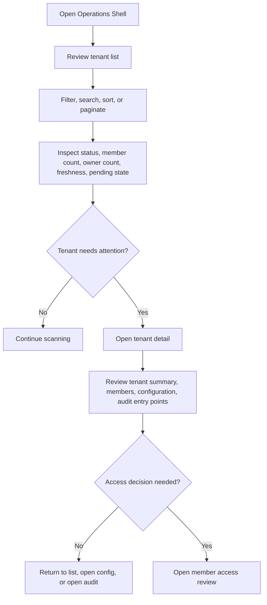
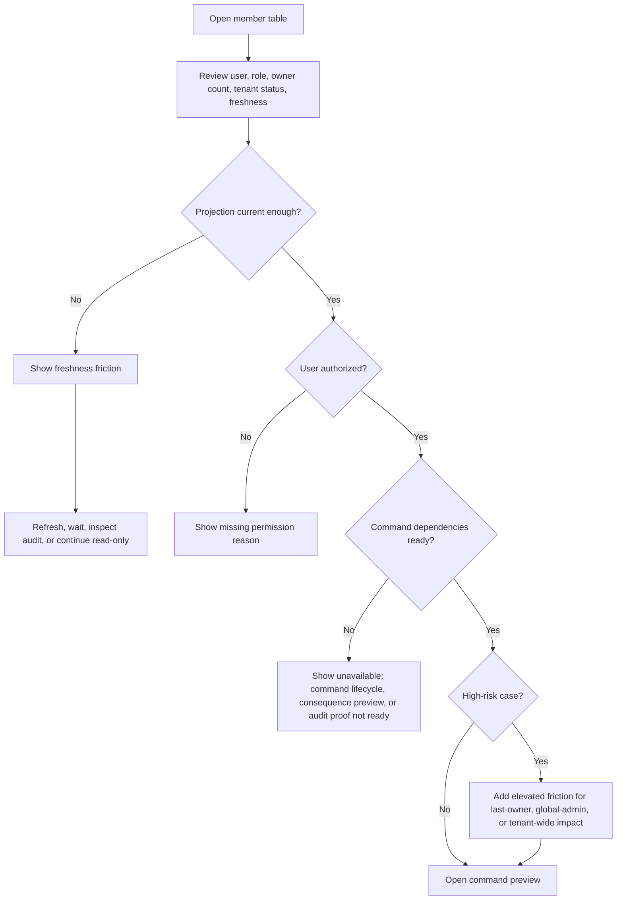
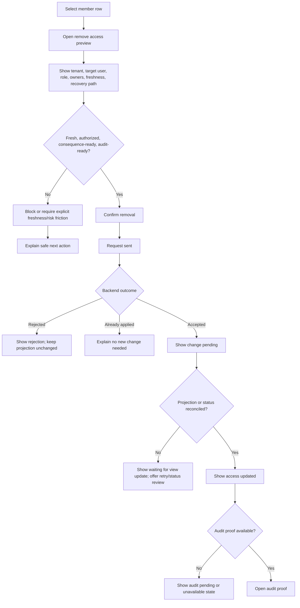
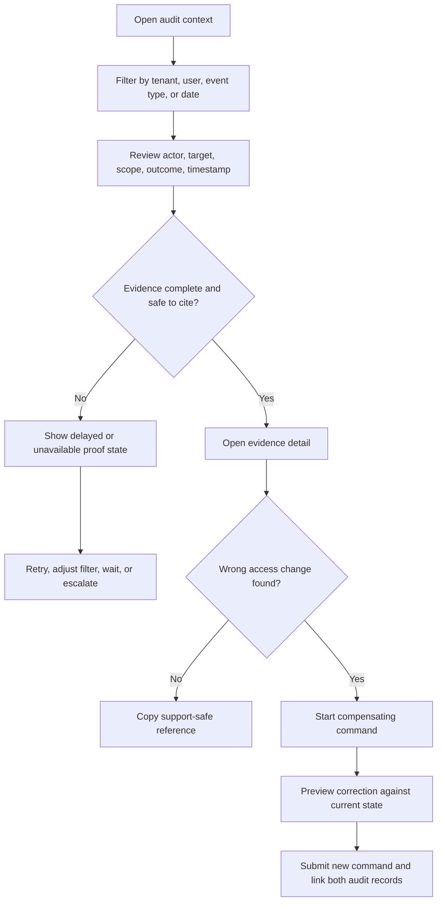

---
stepsCompleted:
  - 1
  - 2
  - 3
  - 4
  - 5
  - 6
  - 7
  - 8
  - 9
  - 10
  - 11
  - 12
  - 13
  - 14
lastStep: 14
status: complete
completedAt: 2026-05-26T17:04:36+02:00
inputDocuments:
  - _bmad-output/planning-artifacts/product-brief-Tenants-2026-03-06.md
  - _bmad-output/planning-artifacts/prd.md
  - _bmad-output/planning-artifacts/prd-validation-report.md
  - _bmad-output/planning-artifacts/architecture.md
  - _bmad-output/planning-artifacts/epics.md
  - _bmad-output/planning-artifacts/research/technical-hexalith-frontcomposer-to-create-tenants-ux-research-2026-05-26.md
  - docs/compensating-commands.md
  - docs/cross-aggregate-timing.md
  - docs/demo.md
  - docs/event-contract-reference.md
  - docs/idempotent-event-processing.md
  - docs/production-auth-claim-contract.md
  - docs/production-auth-readiness.md
  - docs/quickstart.md
  - docs/tenants-ui-frontcomposer-dependency-map.md
  - docs/tenants-ui-phase-2-story-backlog.md
  - _bmad-output/project-context.md
  - Hexalith.Commons/_bmad-output/project-context.md
  - Hexalith.EventStore/_bmad-output/project-context.md
  - Hexalith.FrontComposer/_bmad-output/project-context.md
documentCounts:
  prd: 2
  productBrief: 1
  planningContext: 2
  research: 1
  projectDocs: 10
  projectContext: 4
workflowType: ux-design
project_name: Tenants
user_name: Jerome
date: 2026-05-26
---

# UX Design Specification Tenants

**Author:** Jerome
**Date:** 2026-05-26

---

<!-- UX design content will be appended sequentially through collaborative workflow steps -->

## Executive Summary

### Project Vision

Tenants UI is an operational trust surface for tenant access and configuration. Its job is to help authorized users inspect tenant state, make access-impacting changes safely, and later prove what happened.

The design north star is: users should never have to guess whether they are looking at truth, waiting for truth, or acting on risk. Because changes are event-sourced and projections may lag, the UI must distinguish displayed state, submitted intent, confirmed outcome, and audit evidence.

Every major screen should answer: what is true now, what action am I allowed to take, and how will I know the platform accepted and reflected the change?

The UI is not a CRUD console. Commands are requests, events are the durable business record, projections are user-facing views that may lag, backend authorization is authoritative, UI affordances are guidance, and corrections happen through compensating commands rather than hidden edits.

### Target Users

Global administrators such as Sofia need incident containment, cross-tenant visibility, tenant lifecycle controls, global administrator management, access review, user lookup, and audit investigation.

Tenant owners such as Marc need routine tenant access stewardship: member and role management, tenant configuration review, safe add/remove/change-role workflows, and clear feedback when an action is outside their authority.

Platform operators such as Priya need operational readiness and deployment confidence: production auth readiness, tenant claim correctness, predictable failure modes, health evidence, and clear separation between backend readiness and UI dependency readiness.

Developers such as Alex need integration clarity. The UX should demonstrate the reactive tenant model without compromising stable backend contracts to satisfy generated UI composition.

Security auditors such as Kenji need evidence reconstruction: immutable access history, actor attribution, temporal context, support-safe references, and confidence that corrections are explicit compensating actions.

### Key Design Challenges

The first design challenge is command trust. Accepted submission is not confirmed outcome. The UX must distinguish submitted, awaiting confirmation, reflected, rejected, already applied, and unable-to-verify states without replacing source-of-truth projection data with speculation.

The second challenge is stale-but-valid information. Projection lag is normal, especially after access changes. A removed user may briefly remain visible. The UI must communicate freshness, pending changes, and stale/degraded states without implying stale visibility grants current authority.

The third challenge is security-sensitive role and tenant boundaries. The UI must separate visibility from authority and explain disabled actions: missing permission, stale projection, backend unavailable, unsupported command lifecycle, or high-impact flow not ready.

The fourth challenge is high-impact access management. Disable tenant, remove tenant member, change role, remove global administrator, and risky configuration changes need consequence disclosure, audit context, and compensating-action guidance.

The fifth challenge is concurrency. Two administrators may change the same tenant or membership close together. The UI must handle already-applied outcomes, state changed during review, and preview no longer current.

The sixth challenge is supportability. Users will ask why data still appears, why a command was rejected, who changed access, and whether a pending change completed. The UX must answer without exposing raw command payloads, bearer tokens, stack traces, internal correlation IDs, or sensitive tenant/user data.

### UX Correctness Principles

Optimize for operational truth over speed.

Prefer backend authorization over frontend convenience.

Prefer confirmed evidence over optimistic presentation.

Show what is known and what is not known; consequence previews must not invent certainty about affected sessions, claims, tokens, or downstream services.

Design audit context as evidence, not decoration: actor, target, command intent, event outcome, timestamp, tenant scope, and support-safe reference.

### Design Opportunities

A strong UX can turn event sourcing from an implementation detail into an operational advantage by showing command state, projection freshness, and audit history as first-class parts of the interface.

The product can create a differentiated incident-response experience: exact user ID lookup across tenant access records, scoped revocation workflows, anomaly hints, and clear audit trails can make cross-tenant access review faster and safer.

A maturity-based rollout can deliver value early while reducing risk. Read-only screens validate information architecture and provide fast operational visibility with minimal authority surface. Command-capable screens follow once feedback, authorization, accessibility, localization, and documentation evidence are ready.

FrontComposer can provide consistency and speed for low-risk list/detail composition, while custom overrides handle destructive, audit-heavy, and authorization-sensitive workflows without reshaping Tenants domain contracts.

### Known Assumptions and Open Dependencies

Read-only tenant, member, configuration, global admin, exact user ID lookup, and audit views can mature first. Broader user search/discovery requires an external directory integration or a new backend requirement and is not implied by the current PRD.

Command flows are not ready until command lifecycle feedback, projection confirmation, accessibility, localization, audit display, rejection messaging, and consequence-preview patterns are proven.

Existing FrontComposer table/projection primitives are available. Command lifecycle, concurrent command batching, consequence preview, audit timeline, semantic tokens, accessibility evidence, localization, and component documentation still carry unresolved dependencies or missing evidence.

## Core User Experience

### Defining Experience

The first Phase 2 slice should prove an access-risk workflow end to end. The tenant list helps administrators find tenants worth investigating, but the decisive experience happens in tenant access context: reviewing who has access, understanding whether the data is fresh enough to act on, removing access through a gated command, tracking the command lifecycle, and preserving audit evidence.

The tenant list is an operational triage surface, not a broad command center. It should surface access-risk signals and help an admin decide where to investigate next. The tenant access view is for judgment. The command flow is for access-impacting action. The audit view is for proof.

The first command-capable slice should include one carefully gated command flow. The recommended first command is `RemoveUserFromTenant`, launched from a specific tenant membership row with enough context to explain authority, consequence, lifecycle state, and audit evidence. It best proves the core UX promise: identify who has access, remove access safely, confirm the platform reflected the change, and preserve proof.

`DisableTenant` remains a later high-impact candidate because its blast radius is broader and its consequence preview must explain tenant-wide command impact. If command lifecycle feedback, projection confirmation, consequence preview, and audit context are not ready, `RemoveUserFromTenant` remains a readiness gate rather than an implementation promise.

The core job is: when tenant access is questioned, help an admin see who has access, remove one unsafe access grant, and prove the result.

### Platform Strategy

The UX is a web-based administrative interface built for desktop and laptop workflows. It should assume mouse and keyboard usage, dense tables, fast scanning, filter/search affordances, accessible keyboard navigation, and support for long-running operational sessions.

Mobile and touch are not primary for the first slice. The interface should remain responsive enough to avoid breakage on smaller screens, but the design should optimize for admin workstations, not mobile-first consumption.

Offline functionality is not required. Tenant state, command outcomes, projection freshness, and audit evidence depend on live backend services. When backend or projection status cannot be reached, the UI should show degraded or unable-to-verify states rather than pretending data is current.

### Effortless Interactions

Finding who has access should feel effortless. From the tenant list, an admin should be able to move quickly to tenant membership, role summaries, global access indicators, and user lookup paths without hunting across disconnected screens.

The UX should include a lightweight user lookup path because access questions often start with a person rather than a tenant. In the first slice, user lookup is reachable but does not replace tenant-risk investigation as the primary workflow unless the product direction shifts toward offboarding.

Proving what happened later should also feel effortless. Every access-impacting view should lead naturally toward audit evidence: actor, target, tenant scope, command intent, event outcome, timestamp, and support-safe reference.

The tenant list should reduce cognitive load by surfacing the strongest trustworthy access signals: tenant status, member count, owner count, warning indicators, and projection freshness. It should avoid over-promising signals whose source or meaning is not yet trustworthy.

The UI should preserve context across list, detail, access review, consequence preview, command submission, confirmation, and audit views. An admin should not lose their place after checking access, removing access, or inspecting evidence.

Disabled or unavailable actions should explain the reason: missing permission, stale projection, backend unavailable, command lifecycle unsupported, consequence preview missing, audit evidence unavailable, or high-impact flow not ready.

### Critical Success Moments

The first success moment is when an admin opens the tenant list and understands where access attention is needed.

The second success moment is when the admin can answer "who has access to this tenant, and why?" without switching tools or interpreting raw backend data.

The third success moment is when `RemoveUserFromTenant` makes command truth understandable: submitted intent is separate from accepted request, rejection, already-applied outcome, projected reflection, not-yet-projected state, or unable-to-verify state.

The fourth success moment is audit confidence. Six months later, an auditor or operator should be able to reconstruct who acted, what changed, why it appeared allowed, when it became visible, and what evidence supports the conclusion.

The fifth success moment is safe refusal. When the UI cannot support a command safely, the admin understands why the action is unavailable and what evidence or dependency is missing.

### Experience Principles

Start from the tenant list as the operational triage surface.

Use tenant access context for judgment and command launch.

Optimize for access confidence before command breadth.

Use `RemoveUserFromTenant` as the first command candidate because it best validates access review, consequence preview, command lifecycle, projection confirmation, and audit evidence.

Treat `RemoveUserFromTenant` as an access-evidence journey, not a button: tenant or user lookup, membership context, consequence preview, command lifecycle, projection reflection, and audit evidence.

Make access state and audit evidence easy to reach from every relevant screen.

Show command progress as a lifecycle, not a binary success message.

Do not treat stale projection data as current authority.

Keep read-only visibility useful even when command dependencies are not ready.

Make unavailable actions explainable rather than mysterious.

Warn on allowed-but-dangerous outcomes, such as leaving a tenant ownerless, instead of silently blocking unless product policy changes.

Do not graduate high-blast-radius commands until their consequence and audit patterns are proven.

## Desired Emotional Response

### Primary Emotional Goals

The primary emotional goal is calm confidence under risk. Administrators should feel that the UI is helping them understand access state clearly, act carefully, and prove outcomes without panic or guesswork.

When opening the tenant list, admins should feel calm, in control, alert, and efficient. The screen should communicate that there may be access risks to investigate, but it should not feel noisy, alarming, or chaotic.

After removing access, admins should feel relieved, certain, and accountable. The UI should make clear what was submitted, whether the backend accepted it, whether the projection reflected it, and where the audit evidence can be found.

The experience must avoid distrust. Users should not wonder whether the UI is stale, whether a command actually worked, whether a disabled action is broken, or whether audit evidence exists somewhere else.

### Emotional Journey Mapping

On arrival, the admin should feel oriented. The tenant list should show enough access-risk signals to guide attention without implying false precision.

During investigation, the admin should feel focused. Tenant access detail, membership rows, role summaries, and user lookup paths should make it easy to understand who has access and why.

During command action, the admin should feel careful but supported. Removing access should not feel casual; it should feel bounded, consequence-aware, and reversible only through explicit compensating action.

During confirmation, the admin should feel informed. The UI should distinguish submitted intent, accepted request, rejected request, already-applied outcome, projection reflection, not-yet-projected state, and unable-to-verify state.

When something goes wrong or cannot be verified, the admin should feel cautious and guided rather than blocked without explanation. The UI should show what is known, what is unknown, and what the next safe action is: wait, refresh, retry, inspect audit, or escalate.

On return, the admin should feel continuity. Prior context, recent actions, pending states, and audit references should make the system feel coherent across sessions.

### Micro-Emotions

Confidence matters more than delight. The UI should earn trust through precise state, clear permissions, and explainable outcomes.

Caution is valuable for high-impact actions. Consequence previews and confirmation states should slow users down just enough to prevent careless access changes.

Relief should follow successful access removal only after evidence exists. The UI should avoid premature success messaging before projection or audit confirmation.

Accountability should be present without fear. Audit evidence should feel like operational proof, not surveillance theater.

Patience should be supported during projection lag. A stale or not-yet-projected state should feel expected and handled, not broken.

### Design Implications

Calm confidence requires restrained visual hierarchy, predictable tables, clear status labels, and no unnecessary alarm styling.

Control requires obvious entry points from tenant list to tenant access detail, user lookup, command state, and audit evidence.

Certainty requires lifecycle language that separates submitted, accepted, projected, rejected, already applied, and unable to verify.

Caution requires consequence previews for access-impacting actions, especially when a user may be the last owner or when audit context is unavailable.

Trust requires explaining disabled actions and degraded states without leaking sensitive internals such as raw payloads, bearer tokens, stack traces, internal correlation IDs, or sensitive tenant/user data.

### Emotional Design Principles

Keep the interface calm even when the workflow is serious.

Make uncertainty visible instead of hiding it.

Use caution for risky actions, not fear.

Never imply success before evidence supports it.

Make every unavailable action explainable.

Make audit evidence feel like a natural receipt for action.

Avoid distrust by being explicit about freshness, authority, command lifecycle, and proof.

## UX Pattern Analysis & Inspiration

### Inspiring Products Analysis

Tenants should draw inspiration from operational admin products that help users inspect complex state, act safely, and preserve evidence. The strongest references are not consumer apps, but tools where trust, density, permissions, and auditability matter. Inspiration is useful only when it improves operational confidence, traceable command outcomes, scoped authorization clarity, projection freshness, and accessible recovery from degraded status. Patterns that make the UI feel faster while reducing truthfulness are rejected.

Microsoft Fluent UI Blazor v5 is the primary implementation-aligned control language. Its value is predictability: standard tables, buttons, stacks, tabs, forms, status surfaces, dialogs, and keyboard-accessible controls. For Tenants, Fluent UI should provide the interaction grammar, while tenant-specific semantics define the meaning of states such as stale, confirming, rejected, already applied, and unable to verify. Because the local project pins a prerelease Fluent UI Blazor v5 package, implementation stories must verify exact component APIs against the pinned version before relying on specific parameters or behaviors.

Azure Portal and Microsoft Entra admin center are useful references for progressive disclosure in permission-sensitive administration. Their transferable pattern is list to detail, detail to scoped panels, scoped panels to review-before-commit flows. Tenants should borrow role scoping, permission explanations, and "why can't I do this?" affordances without inheriting deeply nested enterprise configuration mazes.

GitHub is useful for context preservation, governance, and durable history. Its transferable pattern is keeping the current repository, organization, permission, or activity context visible while users move between related views. Hexalith.Tenants should adapt this for tenant, user, role, command, and audit context without making tenancy feel like a software development workflow.

Stripe Dashboard and Cloudflare are useful references for calm operational density. They show complex platform state through restrained tables, scoped filters, readable status language, and careful destructive workflows. Tenants should borrow this restraint for disabled tenants, membership changes, last-owner warnings, global administrator changes, and degraded projection states, while avoiding polished minimalism that hides risk.

Datadog and similar observability tools are useful references for temporal confidence. Their transferable pattern is making sequence, recency, freshness, and uncertainty visible. Tenants should adapt this for command lifecycle, projection lag, audit trails, and support-safe investigation without overwhelming administrators with telemetry-style complexity.

### Transferable UX Patterns

Tenants should feel like an operational control surface for access decisions, not a CRUD console. The user should always understand what command they are about to issue, why it is or is not available, what evidence exists, and whether the current projection may lag behind accepted event truth.

Use Fluent UI Blazor v5 as the component foundation, not as a separate visual theme. Standard Fluent and FrontComposer patterns should carry low-risk browse, filter, inspect, and projection views. Custom overrides are required for destructive, authorization-sensitive, audit-heavy, consequence-preview, and command-lifecycle workflows.

Use dense, full-width work surfaces for tenant administration. The tenant list should behave like an operational console with filtering, sorting, pagination, freshness indicators, and warning states. Tenant detail should use scoped sections or tabs for overview, members, configuration, and audit. The UI should avoid card-heavy dashboard composition for primary work surfaces.

Use one primary action per region. Routine actions should use neutral, outline, subtle, or transparent treatment. Destructive or access-impacting actions need consequence preview, explicit command feedback, and audit linkage rather than visual drama.

Use command preview before submission. Meaningful commands should show the target tenant, affected identity, role or configuration, expected outcome, risk level, and known dependency gaps before submission. This is especially important for remove-user, change-role, disable-tenant, remove-global-administrator, and high-impact configuration flows.

Use temporal truth as a core interaction pattern. Command feedback must distinguish submitted intent, accepted request, confirming state, projected reflection, already-applied outcome, rejection, degraded or unable-to-verify state, and audit evidence availability. SignalR or projection notifications should trigger re-query or status reconciliation; they should not be treated as durable truth.

Use projection freshness as a UI primitive. Lists and detail views should communicate whether data is current, refreshing, stale, delayed, degraded, or unable to verify. Stale visibility must never imply current authority.

Keep unavailable actions visible where safety or authorization clarity matters. Disabled or blocked commands should explain the reason: missing role, tenant state, stale projection, backend unavailable, missing command lifecycle support, missing consequence preview, missing audit evidence, or high-impact flow not ready. Where safe to disclose, the UI should also show the required role or next valid path.

Use audit as a natural receipt. After access-impacting commands, the user should be able to reach actor, target, tenant scope, event outcome, timestamp, and support-safe reference without seeing raw payloads or internal EventStore metadata. Important screens should expose recent audit evidence in context instead of isolating all proof in a separate log area.

Use special guard patterns for last-owner and global-administrator workflows. These scenarios need stronger friction than ordinary confirmation dialogs because they can affect recoverability and platform governance.

Use degraded SignalR and status-reconciliation patterns. Loss of live status should degrade into polling, manual refresh, or needs-review feedback with visible confidence indicators. The UI must preserve the user's context instead of leaving controls permanently locked in confirming state.

### Anti-Patterns to Avoid

Avoid CRUD-console behavior. Commands are requests, events are durable proof, and projections may lag. The UI must not imply that inline table changes instantly mutate source-of-truth state.

Avoid optimistic replacement of projection data. Pending hints are acceptable, but durable row values must remain visually distinct until projection or status confirmation supports the change.

Avoid hiding unavailable actions when the reason matters. Invisible commands create uncertainty and make support harder. Visible unavailable actions with clear reasons are better for operational trust.

Avoid modal-heavy inspection. Dialogs should be reserved for focused command confirmation or consequence review, not for basic navigation, audit reading, or routine detail views.

Avoid generic feedback such as "Saved" or "Done." The vocabulary must distinguish submitted, accepted, confirming, projected, already applied, rejected, degraded, unable to verify, and audit evidence available.

Avoid toast-only confirmation for commands with audit, authorization, or security consequence. Feedback should remain inspectable and linked to source-of-truth status or audit evidence.

Avoid destructive actions styled with the same weight as routine edits. Risk should be communicated through consequence text, placement, iconography, confirmation state, and audit linkage, not color alone.

Avoid permission errors discovered only after form submission. The UI should prevent avoidable failed submissions by making role, tenant state, and command availability visible before the user acts.

Avoid ambiguous empty states. Empty, filtered-empty, unauthorized, stale, failed-to-load, and not-yet-projected states require different language and recovery paths.

Avoid locale-sensitive date and time displays without timezone clarity. Audit and command lifecycle screens must preserve temporal meaning across operators and support investigations.

Avoid exposing internals in support copy. Messages must not show bearer tokens, raw command payloads, serialized command bodies, stack traces, aggregate IDs, internal correlation IDs, raw EventStore metadata, local paths, or sensitive tenant/user data.

Avoid consumer-app delight patterns. The product should not use decorative gradients, playful motion, oversized visual cards, or marketing-style layout. Confidence comes from precision, consistency, and evidence.

Avoid accessibility that depends on color alone. Freshness, risk, command status, and authorization state must be available through text, iconography, structure, focus behavior, and screen-reader-accessible announcements.

### Design Inspiration Strategy

Adopt Fluent UI Blazor v5 for component consistency, accessibility expectations, focus behavior, table behavior, button hierarchy, and standard control semantics. Exact implementation details must be verified against the local prerelease package version during implementation.

Adopt Azure and Entra-style progressive disclosure for tenant administration: list to detail, detail to scoped panels, scoped panels to command flows, and command flows to audit evidence.

Adopt GitHub-style context preservation: users should always know which tenant, user, role, command, and audit record they are working with.

Adopt Stripe and Cloudflare-style operational restraint: dense tables, compact status summaries, clear disabled reasons, and cautious destructive actions.

Adapt observability-style confidence patterns: projection freshness, command lifecycle, degraded states, and audit timelines should make sequence and certainty visible.

Treat read-only FrontComposer table and projection patterns as closest to implementation readiness. Command-capable flows remain provisional until command lifecycle, consequence preview, audit timeline, role availability, accessibility, localization, and documentation evidence are confirmed or explicitly approved as scoped fallbacks.

The resulting strategy is to make Tenants feel like a serious Blazor and Fluent operational console: generated where patterns are low-risk, custom where access, audit, consequence, or command truth require stronger human judgment.

## Design System Foundation

### 1.1 Design System Choice

Tenants will use an established, themeable design system foundation: Microsoft Fluent UI Blazor v5, implemented through Hexalith.FrontComposer where generated composition is appropriate.

This is not a custom design system effort. The UI should use Fluent UI Blazor v5 as the control and interaction language for standard application surfaces: tables, buttons, forms, tabs, stacks, menus, dialogs, status indicators, and accessible focus behavior.

FrontComposer should provide generated consistency for low-risk read-only and projection-driven surfaces. Custom UX patterns are required for command lifecycle, consequence preview, audit evidence, authorization-sensitive flows, destructive actions, global administrator management, and degraded-state recovery.

### Rationale for Selection

Fluent UI Blazor v5 fits the product because Tenants is an operational administration tool, not a branded consumer product. Users need density, predictability, accessibility, keyboard support, restrained visual hierarchy, and clear command affordances more than visual uniqueness.

The design-system choice also matches the technical stack. Hexalith.FrontComposer already depends on Fluent UI Blazor and Blazor patterns, so using Fluent UI avoids a second component system and keeps future implementation aligned with existing shell and generated UI conventions.

An established system reduces delivery risk for Phase 2 Admin UI planning. It allows the team to focus design effort on tenant-specific risks: command truth, projection freshness, role-aware actions, consequence preview, audit evidence, and safe degraded states.

The local project currently pins a prerelease Fluent UI Blazor v5 package. Therefore, this UX specification should treat Fluent UI guidance as component-pattern guidance. Exact component APIs, parameters, and migration details must be verified against the pinned package during implementation.

### Implementation Approach

Use Fluent UI Blazor v5 and FrontComposer for standard operational surfaces:

- Tenant list
- Tenant detail overview
- Member table
- Configuration read-only view
- User lookup results
- Global administrator list
- Audit fallback grids where an approved timeline component is not available

Use FrontComposer-generated patterns only where the workflow is low-risk and source-of-truth boundaries are clear. Generated list, detail, filter, sorting, pagination, loading, empty, and error states are appropriate when they do not imply command completion or hide authorization constraints.

Use custom components or custom overrides for high-risk workflows:

- Remove user from tenant
- Change tenant role
- Disable or enable tenant
- Remove global administrator
- High-impact configuration changes
- Command lifecycle feedback
- Projection freshness and reconciliation
- Consequence preview
- Audit timeline and audit receipt patterns
- Degraded SignalR or status lookup recovery

SignalR and realtime projection notifications should be treated as freshness nudges. The UI must re-query or reconcile against authoritative status or projection data before presenting durable completion.

### Customization Strategy

Customize Fluent UI through restrained semantic tokens, layout rules, and tenant-specific state patterns rather than broad visual restyling.

Define semantic treatments for:

- Tenant status
- Tenant role
- Projection freshness
- Command lifecycle state
- Destructive or high-impact actions
- Audit evidence availability
- Degraded or unable-to-verify states

Do not use color alone to communicate meaning. Every status must have text, accessible labels, and keyboard/screen-reader support.

Keep visual style calm and operational: dense tables, compact summaries, scoped filters, predictable command placement, minimal decoration, and no marketing-style hero sections or card-heavy dashboards.

Use one primary action per region. Routine actions should use neutral, outline, subtle, or transparent treatment. Destructive or privilege-sensitive actions need consequence text, command feedback, and audit linkage rather than exaggerated styling.

Accessibility, localization, and component documentation are part of design-system readiness. Command-capable UI stories should not be considered ready until keyboard behavior, focus return, live-region announcements, localized copy, reduced-motion behavior, forced-colors behavior, and documentation evidence are defined or explicitly scoped as approved fallbacks.

## 2. Core User Experience

### 2.1 Defining Experience

The defining experience for Tenants is the Access Decision Case: a focused workflow that helps an administrator or operator answer whether access exists, whether a change is safe, whether the requested change was actually applied, and whether the outcome can be proven later.

The Access Decision Case is supported internally by an Access Evidence Loop: inspect tenant access with visible freshness, assess whether a scoped change is safe, submit a command with clear consequence and authorization context where command execution is available, track lifecycle truth without assuming immediate success, reconcile visible state with confirmed audit evidence, and recover through explicit compensating commands when the outcome is incomplete, unsafe, or disputed.

The core interaction is not editing a tenant member. It is turning an access concern into a safe decision and durable operational evidence.

A case starts from a tenant, user, role, or audit question. The interface shows current access, source of authority, freshness of the displayed state, related pending changes, and risk signals. Available actions are scoped to the user's permissions and the tenant context. Unavailable actions explain why they are blocked and, where safe, what prerequisite or role would be required.

Users should describe the product as: "I can see who has access, decide safely, make the change, and prove what happened."

### 2.2 User Mental Model

Users arrive with expectations from identity tools, admin consoles, and operational dashboards. They expect lists, filters, detail pages, role badges, disabled actions, confirmation flows, and audit history.

Tenants must preserve those familiar patterns while correcting a dangerous assumption: this is not immediate CRUD editing. The right user-facing mental model is an access decision case. The system-facing truth model remains command intent, event proof, and projection observation.

The experience starts when someone needs to answer one of four questions:

- Who has access?
- Why do they have it?
- Is this change safe?
- Can I prove what happened?

Sofia, the global administrator, thinks in incident and governance terms: which tenants are exposed, who has access, what can I remove, and how do I prove the result?

Marc, the tenant owner, thinks in stewardship terms: who belongs in my tenant, what role should they have, and why is this action unavailable?

Priya, the platform operator, thinks in readiness terms: is auth configured correctly, are projections fresh enough, and are degraded states understandable?

Kenji, the auditor, thinks in evidence terms: who acted, what changed, when did it happen, what was the target scope, and what proof is safe to cite?

Likely confusion points are projection lag, unavailable actions, stale membership rows, command rejection, already-applied outcomes, last-owner warnings, global administrator changes, audit evidence delays, browser refresh during pending actions, and the difference between visible data and current authority.

### 2.3 Success Criteria

The core experience succeeds when a user can answer four questions without leaving the workflow:

- Who has access?
- Am I allowed to act?
- What happened after I submitted the request?
- Where is the proof?

The workflow should feel calm, careful, and certain. It should not make users feel that the UI is hiding state, racing the backend, or inventing success.

Success indicators:

- The first view shows current access picture, data freshness, available actions, risk signals, and proof path.
- Tenant, user, role, tenant state, and projection freshness are visible before command launch.
- Command availability is role-aware and explainable.
- The UI separates "cannot act" from "should not act casually." Missing permission, stale data, unsupported command lifecycle, and high-risk blast radius require different messages.
- Consequence preview identifies the affected tenant, user, role, known risk, and recovery path.
- Command feedback distinguishes request sent, change pending, access updated, could not complete, needs follow-up, already applied, rejected, degraded, and unable-to-verify states.
- Projection data is not overwritten by optimistic hints.
- Audit evidence is reachable after meaningful access changes.
- Last-owner and global-administrator cases receive special friction based on blast radius, not ordinary confirmation-dialog treatment.
- Recovery points users toward compensating commands, not hidden undo.
- Keyboard, screen-reader, localization, reduced-motion, and forced-colors behavior remain viable.

### 2.4 Novel UX Patterns

The workflow combines established admin patterns with a Hexalith-specific truth model.

Established patterns include list/detail navigation, scoped filters, member tables, role/status badges, command buttons, confirmation flows, disabled action explanations, and audit trails.

The novel pattern is explicitly separating the user-facing access decision from the underlying command, projection, and audit evidence lifecycle. Most admin tools collapse these into a single success state. Tenants should make the distinction visible without forcing users to learn event-sourcing terminology.

Preferred user-facing state language:

- "Data current as of..."
- "Request sent"
- "Change pending"
- "Access updated"
- "Could not complete"
- "Needs follow-up"
- "Audit proof available"
- "Some actions unavailable because..."

Freshness states should be visible and calm:

- Current
- Updating
- Delayed
- Unable to verify

The unique UX principle is: never trade truthfulness for perceived speed.

### 2.5 Experience Mechanics

**1. Initiation**

The user starts from tenant list, tenant detail, user lookup, or audit context. The entry point preserves tenant, user, role, tenant status, projection freshness, pending changes, and the user's authority.

Risk indicators guide attention: disabled tenant, no owners, stale projection, unusual access, global-admin scope, audit evidence unavailable, or degraded live updates.

**2. Investigation**

The user reviews access in a dense operational view. Member rows show user, role, status context, freshness state, and available actions.

Unavailable actions remain visible where safety or authorization clarity matters. The UI explains missing role, stale projection, backend unavailable, missing consequence preview, missing audit evidence, high-impact flow not ready, or command execution unavailable.

Where command execution is not ready, the UI should provide read-only fallback behavior and explain the missing prerequisite instead of implying that the action is broken.

**3. Decision**

Before action, the user sees enough context to decide safely. For `RemoveUserFromTenant`, the preview shows tenant, target user, current role, known consequences, last-owner warning if relevant, remaining owners, recovery path, and audit availability.

The preview does not claim unknown downstream effects such as active session termination, token revocation, or consuming-service enforcement unless backend evidence exists.

For last-owner and global-administrator cases, the confirmation should feel like an evidence-backed control checklist, not an ordinary "Are you sure?" dialog. These flows require risk explanation, affected scope, current evidence freshness, audit consequence, and intentional elevated confirmation where implementation capability allows it.

**4. Submission**

The user submits a scoped request. The UI records a local pending entry but does not replace projection truth. The affected row may show a pending or confirming hint while preserving the last confirmed projection state.

Authorization scoping should be visible before submit: the user should know which tenant they are acting in, which user or role is affected, and which authority enables or blocks the action.

**5. Reconciliation**

The UI distinguishes request submission, accepted request, projection confirmation, rejection, already-applied outcome, degraded state, and unable-to-verify state.

SignalR notifications act as freshness nudges and trigger re-query or status reconciliation. They do not directly become durable truth.

If projection confirmation is delayed, the UI preserves context and offers safe re-query or status review. If the request is rejected, the UI explains the reason and what happened to displayed data. If live updates fail, the UI says status is delayed, switches to polling or manual refresh where available, and avoids implying success.

**6. Proof**

The workflow completes only when the user can see the resulting state or understand why it cannot yet be verified. Meaningful access changes should provide a path to audit evidence: actor, target, tenant scope, request outcome, event outcome, timestamp, and support-safe reference.

Audit evidence should be reachable directly from the command result and from the affected tenant or user access view. Users should not need to reconstruct access decisions from raw logs.

**7. Recovery**

If the wrong access grant was changed, the UI guides the user toward compensating commands. The original event remains part of the audit trail. The correction is a new explicit command with its own consequence preview and proof.

Recovery should feel designed, not exceptional. Useful recovery paths include reassign tenant owner, restore intended access through a new add-user command, retry access removal, open audit evidence, or escalate when proof is incomplete.

### Persona-Specific Experience Outcomes

For Sofia, the global administrator, the Access Decision Case succeeds when she can move from access concern to verified containment without switching tools. She needs cross-tenant visibility, scoped command authority, and audit proof.

For Marc, the tenant owner, the case succeeds when he can understand who belongs in his tenant, why a role or removal action is available or unavailable, and what changed after he acted.

For Priya, the platform operator, the case succeeds when degraded auth, stale projection, SignalR delay, or backend unavailability is visible without creating false confidence.

For Kenji, the auditor, the case succeeds when evidence can be reconstructed later: actor, target, tenant scope, request outcome, event outcome, timestamp, and support-safe reference.

### Stress Scenarios

The core experience must hold under these scenarios:

- A removed user remains visible briefly because the projection has not caught up.
- Two administrators act on the same tenant membership close together.
- A request is accepted, but SignalR is delayed or disconnected.
- The requested change is already applied by the time the user submits.
- The user lacks permission, but the action is visible in context.
- Removing a user would leave the tenant without an owner.
- Removing a global administrator risks platform recovery.
- Audit evidence is delayed, unavailable, or not yet implemented.
- The browser refreshes while a request is still confirming.

In each case, the UI should preserve context, avoid premature success, explain what is known, and provide the next safe action.

### Accessibility and Acceptance Evidence

Status changes should use accessible live regions, with assertive announcements only for failures or high-risk blockers. Disabled actions should expose readable reasons, not only tooltips. Color must never be the only signal for stale, failed, pending, confirmed, risk, or authorization state.

Confirmation dialogs and custom confirmation surfaces must support keyboard-only completion, focus trapping where modal behavior is used, escape behavior, and clear return focus. Timestamps need exact accessible text, not only relative labels such as "just now." Localized strings must handle status names, risk warnings, dates, tenant names, and pluralization without concatenated sentence fragments.

Representative acceptance checks:

```gherkin
Given a sensitive access change is attempted from a stale projection
When the user opens the command preview
Then the UI blocks the action or adds explicit freshness friction
And explains whether the user can refresh, acknowledge, or wait
```

```gherkin
Given a request is submitted
When processing is not complete
Then the UI shows the request scope, lifecycle state, and safe next action
And does not overwrite the last confirmed projection state
```

```gherkin
Given request success is reported but projection is not reconciled
When the user views the affected access row
Then the UI shows that the change is accepted and waiting for view update
And does not present completed proof until audit or projection evidence is available
```

```gherkin
Given SignalR is disconnected
When an access change is pending
Then status indicators remain accurate
And the UI announces degraded updates
And the workflow never silently freezes in a misleading success state
```

### Defining Experience Risks

The defining experience fails if the UI implies success before evidence supports it, hides unavailable actions, treats stale projection data as authority, exposes internal command details, makes destructive actions feel routine, or leaves users without an audit path after access-impacting commands.

The experience also fails if it becomes too technical. Users need operational truth, not raw event-sourcing vocabulary. The UI should translate the model into clear state language and safe next actions.

Non-negotiable experience rules:

- Never imply access changed until the system has enough evidence to support that claim.
- Never treat stale projection visibility as current authority.
- Never hide the reason an access-impacting action is unavailable when that reason can be safely disclosed.
- Never make audit evidence feel optional after meaningful access changes.
- Never frame compensating commands as undo.
- Never require users to understand event-sourcing vocabulary to act safely.

## Visual Design Foundation

### Color System

Tenants should follow Microsoft Fluent UI as the visual authority. The product should not introduce a separate branded palette for Phase 2. Visual consistency should come from Fluent UI theme tokens, semantic color roles, and restrained operational usage.

The base theme should use Fluent neutral surfaces for application chrome, tables, panels, dialogs, cards, and forms. Primary actions should use the Fluent brand/accent treatment supplied by the active theme. Secondary, subtle, and transparent actions should preserve Fluent hierarchy rather than adding custom button colors.

Tenant-specific meaning should be mapped through semantic roles, not hard-coded colors:

- Tenant status: active, disabled, degraded
- Projection freshness: current, updating, delayed, unable to verify
- Command lifecycle: request sent, change pending, access updated, rejected, already applied, needs follow-up
- Authorization state: available, unavailable, missing permission, blocked by stale data
- Audit evidence: available, delayed, unavailable
- Risk state: last owner warning, global administrator risk, destructive action

Color must support meaning, not carry it alone. Every state needs readable text, accessible labels, and appropriate iconography or shape. Warning and destructive treatments should be used sparingly so that high-impact access changes remain visible without making the whole interface feel alarming.

Exact Fluent UI Blazor component APIs and token names must be verified against the project-pinned package during implementation.

### Typography System

Typography should use the Microsoft Fluent typographic approach: system UI fonts, clear hierarchy, compact density, and high readability. The recommended stack is the platform/system stack led by Segoe UI where available, falling back to standard sans-serif fonts.

The tone should feel professional, calm, precise, and operational. This is an administration surface for access decisions and audit evidence, so typography should prioritize scanning, comparison, and accurate status interpretation over expressive branding.

Type hierarchy should be modest:

- Page titles identify the current tenant, user, or operational scope.
- Section headings separate access, configuration, command status, and audit evidence.
- Table text remains compact and readable for long sessions.
- Status labels and helper text use clear plain language rather than technical event-sourcing vocabulary.
- Confirmation and risk text should be slightly more prominent than ordinary helper text, but not oversized.

The interface should avoid hero-scale type except where no operational content is competing for attention. Dense tables, dialogs, command previews, and audit surfaces should use compact headings sized to their containers.

### Spacing & Layout Foundation

The layout should feel dense, efficient, and stable. Tenants is an operational console, not a marketing site or card dashboard. Spacing should support repeated scanning of tenant lists, member tables, role summaries, pending command states, and audit records.

Use a Fluent-compatible spacing rhythm with small increments suitable for enterprise UI. A 4px base rhythm with common 8px, 12px, 16px, 24px, and 32px steps is appropriate.

Layout principles:

- Use full-width operational surfaces with constrained readable inner regions where needed.
- Prefer tables, split views, tabs, side panels, dialogs, and inline status regions over decorative card grids.
- Keep command controls close to the affected tenant, user, role, or audit context.
- Preserve context across list, detail, command preview, confirmation, and audit evidence.
- Keep stable dimensions for status chips, action cells, toolbars, and command lifecycle regions to avoid layout shift.
- Use whitespace to group meaning, not to create visual drama.

Desktop and laptop workflows are primary. Responsive behavior should prevent breakage on smaller screens, but the first design target is an admin workstation with keyboard and mouse usage.

### Accessibility Considerations

Accessibility is part of the visual foundation, not a later implementation detail.

All semantic states must meet contrast requirements in light, dark, high-contrast, and forced-colors contexts. Color cannot be the only indicator of tenant status, projection freshness, command lifecycle, risk, authorization, or audit availability.

Status changes should be understandable to keyboard and screen-reader users. Pending, rejected, delayed, unable-to-verify, and proof-available states need accessible names and appropriate live-region behavior. Assertive announcements should be reserved for failures or high-risk blockers.

Disabled or unavailable actions must expose readable reasons. Tooltips alone are not enough for important authorization or safety explanations.

Confirmation flows must support keyboard completion, focus trapping when modal, escape behavior where safe, clear return focus, and reduced-motion behavior. Timestamps need exact accessible text, not only relative labels.

Localized strings should cover state names, risk warnings, dates, tenant names, roles, and pluralization without concatenated sentence fragments.

## Design Direction Decision

### Design Directions Explored

Six Fluent-aligned operational directions were explored:

- Operations Shell
- Access Review Split
- Command Lifecycle Desk
- Audit Evidence Workspace
- User Lookup First
- Incident Containment Board

Each direction used Microsoft Fluent UI as the visual foundation and tested a different emphasis for tenant access review, projection freshness, command lifecycle feedback, and audit evidence.

### Chosen Direction

The selected base direction is **Direction 1: Operations Shell**.

This direction uses a familiar Fluent administrative shell with persistent navigation, a tenant list as the primary triage surface, compact operational metrics, scoped detail context, and direct paths into access review and audit evidence.

### Design Rationale

Operations Shell is the best base because it balances routine tenant administration with access-risk investigation. It gives users a recognizable admin-console structure while preserving the UX principles already established: calm density, visible freshness, role-aware action availability, and audit evidence as a natural next step.

It works especially well for the first Phase 2 UI because the tenant list remains useful even before command-capable flows mature. Read-only views, projection freshness, owner-risk warnings, member counts, and audit entry points can provide immediate value while `RemoveUserFromTenant` and other command flows are added behind stronger readiness gates.

### Implementation Approach

Use the Operations Shell as the main layout pattern:

- Left navigation for Tenants, Users, Global Administrators, and Audit.
- Tenant list as the default operational triage view.
- Compact metric summaries for tenant count, owner risk, pending commands, and projection freshness.
- Fluent table patterns for tenant and member review.
- Detail or side-panel context for selected tenant state, risks, and available next actions.
- Direct access from tenant rows to access review and audit evidence.
- Command lifecycle and audit evidence patterns from the other directions should be incorporated inside the shell rather than becoming separate primary navigation models.

The shell should remain dense, stable, and Fluent-native. It should avoid decorative dashboard cards and instead prioritize scan-friendly tables, clear status labels, explainable unavailable actions, and preserved context across tenant list, access review, command feedback, and audit evidence.

## User Journey Flows

### Journey 1: Tenant Discovery and Triage

Users start in the Operations Shell tenant list. The purpose is not to act immediately; it is to find the tenant or access condition that deserves review.

**User decision:** Is this tenant safe and relevant enough to review now?


```mermaid
flowchart TD
    A[Open Operations Shell] --> B[Review tenant list]
    B --> C[Filter, search, sort, or paginate]
    C --> D[Inspect status, member count, owner count, freshness, pending state]
    D --> E{Tenant needs attention?}
    E -- No --> F[Continue scanning]
    E -- Yes --> G[Open tenant detail]
    G --> H[Review tenant summary, members, configuration, audit entry points]
    H --> I{Access decision needed?}
    I -- No --> J[Return to list, open config, or open audit]
    I -- Yes --> K[Open member access review]
```

### Journey 2: Access Review and Action Availability

Access review is the safety gate between read-only discovery and command-capable workflows. It must explain whether the user cannot act, should not act yet, or can proceed.

**User decision:** Can I act now, and if not, is the blocker permission, freshness, risk, lifecycle readiness, or proof readiness?


```mermaid
flowchart TD
    A[Open member table] --> B[Review user, role, owner count, tenant status, freshness]
    B --> C{Projection current enough?}
    C -- No --> D[Show freshness friction]
    D --> E[Refresh, wait, inspect audit, or continue read-only]
    C -- Yes --> F{User authorized?}
    F -- No --> G[Show missing permission reason]
    F -- Yes --> H{Command dependencies ready?}
    H -- No --> I[Show unavailable: command lifecycle, consequence preview, or audit proof not ready]
    H -- Yes --> J{High-risk case?}
    J -- Yes --> K[Add elevated friction for last-owner, global-admin, or tenant-wide impact]
    J -- No --> L[Open command preview]
    K --> L
```

### Journey 3: Remove User From Tenant

`RemoveUserFromTenant` is the first command-capable journey. The UI preserves confirmed projection truth while showing submitted intent and pending state separately.

**User decision:** Did the removal request get accepted, did the visible tenant access state catch up, and is proof available?


```mermaid
flowchart TD
    A[Select member row] --> B[Open remove access preview]
    B --> C[Show tenant, target user, role, owners, freshness, recovery path]
    C --> D{Fresh, authorized, consequence-ready, audit-ready?}
    D -- No --> E[Block or require explicit freshness/risk friction]
    E --> F[Explain safe next action]
    D -- Yes --> G[Confirm removal]
    G --> H[Request sent]
    H --> I{Backend outcome}
    I -- Rejected --> J[Show rejection; keep projection unchanged]
    I -- Already applied --> K[Explain no new change needed]
    I -- Accepted --> L[Show change pending]
    L --> M{Projection or status reconciled?}
    M -- No --> N[Show waiting for view update; offer retry/status review]
    M -- Yes --> O[Show access updated]
    O --> P{Audit proof available?}
    P -- No --> Q[Show audit pending or unavailable state]
    P -- Yes --> R[Open audit proof]
```

### Journey 4: Audit Evidence and Compensating Recovery

Audit evidence completes access-impacting workflows. Recovery is explicit: users start a new compensating command, never a hidden undo.

**User decision:** Can I prove what happened, or do I need to retry, investigate, escalate, or repair through a compensating command?


```mermaid
flowchart TD
    A[Open audit context] --> B[Filter by tenant, user, event type, or date]
    B --> C[Review actor, target, scope, outcome, timestamp]
    C --> D{Evidence complete and safe to cite?}
    D -- No --> E[Show delayed or unavailable proof state]
    E --> F[Retry, adjust filter, wait, or escalate]
    D -- Yes --> G[Open evidence detail]
    G --> H{Wrong access change found?}
    H -- No --> I[Copy support-safe reference]
    H -- Yes --> J[Start compensating command]
    J --> K[Preview correction against current state]
    K --> L[Submit new command and link both audit records]
```

### Truth State Model

Every journey follows a shared truth-state contract so implementation does not reinterpret "current", "accepted", "confirmed", or "audited" differently by screen.

| State dimension | User-facing question | Required UI behavior |
|---|---|---|
| Freshness | Is the displayed projection current enough to use? | Show current, refreshing, aging, stale, or unknown freshness before access-impacting actions. |
| Authorization | Is this user allowed to act in this tenant context? | Separate missing permission from stale data, blocked risk, and unavailable implementation dependency. |
| Command lifecycle | What happened to the submitted intent? | Distinguish eligible, previewed, submitted, accepted, rejected, already applied, failed, duplicate, timeout, and unknown. |
| Projection confirmation | Has the visible read model reflected the accepted command? | Preserve last confirmed projection data and show pending confirmation separately. |
| Audit evidence | Is proof available and safe to cite? | Show audit pending, audit available, delayed, unavailable, or approved fallback state. |

Stale-data thresholds must be defined by implementation stories using timestamp, projection version, or ETag evidence available from the relevant read model. If freshness cannot be measured, the state is unknown and destructive action fails closed.

### RemoveUserFromTenant Command State Model

`RemoveUserFromTenant` should use a formal command state model:

```text
eligible -> previewed -> submitted -> accepted -> projection_pending -> confirmed | failed | unknown | audit_pending | audit_available
```

Each state requires visible UI copy, enabled and disabled actions, retry behavior, and a support-safe reference where available.

- `eligible`: user can open preview because authorization, freshness, and dependency gates pass.
- `previewed`: consequence preview shows tenant, target user, role, owner risk, freshness, known consequences, known unknowns, and recovery path.
- `submitted`: request was sent; projection remains unchanged until confirmed.
- `accepted`: backend accepted processing; this is not proof of visible access change.
- `projection_pending`: command accepted but tenant/member projection has not reconciled.
- `confirmed`: projection or status reconciliation supports that access was updated.
- `failed`: rejection, transport failure, or lifecycle terminal failure is visible with next action.
- `unknown`: status lookup, SignalR, or projection confirmation is unavailable; UI avoids success language.
- `audit_pending`: visible access state is updated but audit proof is not yet available.
- `audit_available`: audit evidence is available with a support-safe reference.

### Journey Invariants

Every journey follows the same truth model:

- Start from a source-of-truth read surface.
- Show freshness before action.
- Gate by authorization and dependency readiness.
- Keep confirmed projection data separate from submitted intent.
- Treat SignalR as a freshness nudge, not proof.
- Complete meaningful access changes with audit evidence.
- Recover through compensating commands.

### Flow Optimization Principles

- Read-only discovery should remain valuable before command flows are ready.
- The UI must distinguish stale data, missing permission, unsupported command lifecycle, backend degradation, missing consequence preview, and missing audit proof.
- Do not claim session revocation, downstream enforcement, or token invalidation unless backend evidence exists.
- Last-owner, global-administrator, and tenant-wide cases require elevated friction.
- Unknown freshness, incomplete consequence preview, indeterminate authorization, or missing lifecycle support blocks destructive action by default unless an approved override path exists.
- Unavailable actions should remain visible when the reason helps safety or understanding.
- Every command-capable story must define pending, rejected, already-applied, delayed, degraded, unable-to-verify, proof-pending, and proof-available states.

### Concurrency and Recovery Cases

The journeys must handle high-probability event-sourced edge cases explicitly:

- Target user was already removed before submit.
- Tenant status changed while preview was open.
- Operator lost permission mid-flow.
- Duplicate submit or browser refresh occurred during pending state.
- Projection lagged after command acceptance.
- Command accepted but audit evidence was delayed.
- SignalR disconnected or produced only a freshness nudge.
- Confirmation became unknown because status lookup failed.

Recovery choices must be concrete: refresh, wait, retry status lookup, inspect audit, continue read-only, request permission, start a compensating command, or escalate with a support-safe reference.

### Implementation Story Rules

Future UI stories should fail closed unless they can name:

- Source projection or query used for the screen.
- Freshness state shown to the user.
- Authorization state and unavailable-action reason.
- Command lifecycle states, if the story dispatches commands.
- Consequence preview inputs for access-impacting actions.
- Audit evidence path or approved read-only fallback.
- Support-safe observability references, such as command reference, tenant/user reference, projection version or freshness marker, accepted timestamp, and audit event reference or fallback state.
- Accessibility behavior for focus, keyboard use, live status, and disabled explanations.
- Localization responsibility for state labels, timestamps, roles, and warnings.

These rules are acceptance criteria for the UX promise, not merely implementation preferences: the user must be able to decide what is known, what is pending, what is risky, and what proof exists.

## Component Strategy

### Design System Components

Tenants should use Microsoft Fluent UI Blazor and Hexalith.FrontComposer as the component foundation.

Use Fluent UI for standard primitives:

- Navigation: `FluentNav`, `FluentNavItem`, section headers.
- Tables and grids: `FluentDataGrid`, grid rows, grid cells, sorting support.
- Actions: `FluentButton`, anchor buttons, split or menu buttons.
- Menus: `FluentMenu`, `FluentMenuList`, `FluentMenuItem`.
- Dialogs: `FluentDialog`, dialog body, dialog provider.
- Inputs: text input, selects, filters, search fields.
- Tabs: `FluentTabs`, `FluentTab`.
- Status communication: `FluentBadge`, counter badges, presence badges, `FluentMessageBar`.
- Layout: Fluent grid and FrontComposer shell/layout primitives.

Use FrontComposer where current evidence supports it:

- Projection and DataGrid rendering: available.
- Shell and page layout: usable, but full-width/constrained layout behavior needs confirmation.
- Pending command and feedback services: present, but Tenants-compatible lifecycle contract needs confirmation.
- Audit timeline: missing as reusable evidence; flat DataGrid fallback requires approval.
- Consequence preview: missing as reusable evidence; inline fallback requires approval.
- Semantic role/status tokens: partial; timeline and consequence tokens need confirmation.
- Accessibility, localization, and documentation evidence: required for each UI story.

Exact Fluent UI Blazor APIs must be verified against the project-pinned package during implementation.

### Custom Components

#### Truth State Badge

**Purpose:** Show shared truth-state vocabulary across tenant list, detail, member table, command feedback, and audit.

**Usage:** Freshness, authorization, command lifecycle, projection confirmation, and audit evidence states.

**States:** current, refreshing, aging, stale, unknown, eligible, blocked, pending, accepted, confirmed, failed, audit pending, audit available.

**Accessibility:** Text label required; color and icon are secondary. Must work in forced-colors mode.

#### Freshness Gate

**Purpose:** Decide whether access-impacting action can proceed from the current projection state.

**Content:** Freshness label, timestamp/version marker, refresh action, blocking reason.

**Behavior:** Unknown freshness fails closed for destructive actions.

#### Unavailable Action Reason

**Purpose:** Make disabled or unavailable actions explainable without relying only on tooltips.

**Content:** Reason category: missing permission, stale data, missing lifecycle support, missing consequence preview, missing audit proof, high-impact flow not ready.

**Behavior:** Visible inline reason for high-impact actions; tooltip may supplement but not replace.

#### Consequence Preview

**Purpose:** Explain known consequences and known unknowns before access-impacting commands.

**Content:** Tenant, target user, current role, owner count, affected access path, freshness, recovery path, audit expectation.

**Behavior:** Blocks submit if consequence inputs are incomplete unless product/UX approves a named fallback.

#### Command Lifecycle Panel

**Purpose:** Show command state without overwriting confirmed projection data.

**States:** eligible, previewed, submitted, accepted, projection pending, confirmed, failed, unknown, audit pending, audit available.

**Content:** Support-safe command reference, accepted timestamp, projection confirmation status, retry/status review action, audit link or fallback state.

#### Audit Evidence Receipt

**Purpose:** Give users proof after meaningful access changes.

**Content:** Actor, target, tenant scope, outcome, timestamp, projection marker, audit reference.

**Behavior:** Supports copyable support-safe reference without exposing raw payloads or sensitive internals.

#### Flat Audit List Fallback

**Purpose:** Provide a first-slice audit surface if a reusable audit timeline is not ready.

**Implementation:** DataGrid-backed audit list with stable ordering, filters, empty/loading/error states, and accessible expansion.

### Component Implementation Strategy

Use standard Fluent UI and FrontComposer primitives for low-risk read-only surfaces first. Custom components should wrap or compose Fluent components rather than create a separate design system.

Command-capable components remain gated until lifecycle, consequence preview, audit proof, accessibility, localization, and documentation evidence are ready or explicitly approved as scoped fallbacks.

Component rules:

- Prefer DataGrid for tenant list, member table, user lookup, and flat audit fallback.
- Use badges only with text labels and accessible names.
- Use dialogs or side panels only when focus behavior, return focus, and keyboard completion are specified.
- Keep command feedback close to the affected row or tenant context.
- Never use optimistic UI to replace source-of-truth projection data.
- Every component that blocks an action must expose the reason safely.

### Implementation Roadmap

**Phase 1 - Read-Only Foundation**

- Operations Shell navigation.
- Tenant List DataGrid.
- Tenant Detail overview.
- Member Table.
- Truth State Badge.
- Freshness Gate.
- Unavailable Action Reason.

**Phase 2 - First Command-Capable Slice**

- Consequence Preview for `RemoveUserFromTenant`.
- Command Lifecycle Panel.
- Audit Evidence Receipt.
- Flat Audit List fallback, if approved.
- Support-safe observability references.

**Phase 3 - High-Impact and Governance Flows**

- Disable or enable tenant consequence flow.
- Global administrator management flow.
- Configuration edit consequence classification.
- Concurrent command and notification batching.
- Reusable audit timeline, if promoted from fallback.

## UX Consistency Patterns

### Button Hierarchy

Use Fluent button hierarchy consistently.

Primary buttons are reserved for the main safe action in the current region: open selected tenant, apply filter, confirm non-destructive form, or submit an eligible command.

Destructive actions such as remove user, disable tenant, remove global administrator, or remove configuration value must not appear as casual primary actions. They require consequence preview, eligibility checks, and explicit confirmation.

Button rules:

- One primary action per region.
- Destructive actions use danger treatment plus consequence preview, not visual alarm alone.
- Disabled actions must expose a safe reason.
- Row-level commands stay close to the affected row.
- Retry, refresh, inspect audit, and continue read-only are secondary actions.
- Do not hide unavailable high-impact actions when the reason helps understanding.

### Feedback Patterns

Feedback must follow the truth-state model: freshness, authorization, command lifecycle, projection confirmation, and audit evidence.

Do not collapse accepted, projected, and proven into one success state.

Feedback states:

- Current: projection can be used for read-only review.
- Refreshing: query or projection update is in progress.
- Aging: projection may still be usable, but action friction may be needed.
- Stale: action is blocked or requires refresh.
- Unknown: destructive action fails closed.
- Submitted: request sent, no outcome yet.
- Accepted: backend accepted processing, not proof.
- Projection pending: accepted but visible read model has not reconciled.
- Confirmed: projection or status supports the visible change.
- Audit pending: visible state updated but proof unavailable.
- Audit available: support-safe proof can be opened or cited.
- Failed or rejected: explain outcome and next safe action.

Feedback should appear close to the affected tenant, row, command panel, or audit context. Global message bars should be used only for page-level degradation or system-wide service state.

### Form Patterns

Forms should be compact, validated, and scoped to one user decision.

Read-only forms and detail views use Fluent fields or description layouts without implying editability. Editable command forms require validation before submit and lifecycle feedback after submit.

Form rules:

- Validate required fields before command preview.
- Keep tenant, user, role, and freshness context visible while editing.
- Do not submit access-impacting forms if freshness, authorization, or consequence inputs are unknown.
- Preserve user input if backend validation fails.
- Map domain rejections to safe, localized user-facing text.
- Do not expose raw command payloads, stack traces, tokens, or internal exception text.

### Navigation Patterns

The Operations Shell is the stable navigation model.

Primary navigation:

- Tenants
- Users
- Global Administrators
- Audit

The tenant list is the default triage surface. Tenant detail preserves tenant context across overview, members, configuration, command state, and audit evidence.

Navigation rules:

- Preserve selected tenant and filters when returning from detail.
- Keep tenant, user, and role context visible during command preview.
- User lookup is secondary but reachable from shell navigation.
- Audit can be entered from global navigation, tenant rows, tenant detail, user lookup, and command result.
- Do not make command lifecycle a separate primary navigation model; show it inside the affected workflow.

### Search, Filtering, and Table Patterns

Use DataGrid-backed patterns for tenant list, member table, user lookup, and flat audit fallback.

Table rules:

- Provide search or filter only when it can operate on a trustworthy query or projection.
- Show loading, empty, filtered-empty, error, stale, and degraded states distinctly.
- Keep row actions stable in width and placement.
- Sort and pagination must not hide pending or stale-state indicators.
- Long tenant IDs, user IDs, and references should truncate visually but remain accessible.
- Avoid relying on arbitrary row text for automation; implementation should use stable selectors or component contracts.

### Modal, Preview, and Confirmation Patterns

Use dialogs or side panels only when focus, keyboard behavior, return focus, and escape behavior are defined.

Consequence preview is not a generic confirmation dialog. It must show what is known, what is unknown, and what recovery path exists.

Preview rules:

- Show affected tenant, user, role, owner count, freshness, known consequences, known unknowns, audit expectation, and recovery path.
- Last-owner, global-administrator, and tenant-wide actions require elevated friction.
- Unknown freshness, incomplete consequence preview, indeterminate authorization, or missing lifecycle support blocks destructive action by default.
- Confirmation copy must be localizable and should not rely on sentence fragments assembled at runtime.

### Empty, Loading, Stale, and Degraded States

Empty states should help the user understand whether there is no data, no matching filtered data, no permission, or unavailable backend state.

State rules:

- Loading: show what is being loaded and keep layout stable.
- Empty: explain the absence without implying failure.
- Filtered empty: offer clear filter reset.
- Stale: show freshness marker and refresh path.
- Degraded: explain what is unavailable and what still works.
- Unable to verify: avoid success language and offer retry, inspect audit, continue read-only, or escalate.
- Audit unavailable: distinguish delayed evidence from missing implementation support.

### Additional Patterns

#### Support-Safe References

Use support-safe references for command and audit troubleshooting. Do not expose raw payloads, bearer tokens, stack traces, or sensitive internals.

#### Compensating Recovery

Never label recovery as undo. Use language such as start correction, restore intended access, retry status lookup, inspect audit, or escalate.

#### Localization

All state labels, role names, timestamps, warnings, disabled reasons, and recovery actions must be localizable.

#### Accessibility

Disabled explanations, command lifecycle changes, stale/degraded states, and audit availability must be perceivable without color. Keyboard users must be able to complete or exit every modal, preview, and command flow.

## Responsive Design & Accessibility

### Responsive Strategy

Tenants should use a desktop-first operational strategy with responsive support. The primary users are administrators, tenant owners, operators, and auditors working in dense, long-running admin sessions.

Desktop and laptop layouts are primary. Use available width for persistent shell navigation, tenant list tables, detail panels, member tables, command context, and audit evidence. Desktop should support fast scanning, keyboard use, side-by-side context, and stable row actions.

Tablet layouts should remain usable but may simplify density. Navigation can collapse, detail panels can stack below tables, and command previews can use full-width dialogs or panels. Touch targets must remain large enough, but the product should not redesign around gesture-heavy workflows.

Mobile is not the primary target for the first slice. The interface should not break on small screens, but mobile should be treated as limited support for read-only triage, lookup, and audit reference review. High-impact access changes should be discouraged or unavailable on very small screens unless the full consequence, focus, and confirmation experience can be preserved.

Responsive behavior should prioritize truth and context over visual compactness. If a small screen cannot show freshness, authorization, consequence preview, lifecycle feedback, and audit path together, the action should fail closed or become read-only.

### Breakpoint Strategy

Use standard breakpoints as implementation guidance:

- Mobile: 320px to 767px
- Tablet: 768px to 1023px
- Desktop: 1024px and above
- Wide desktop: 1440px and above

Desktop is the design baseline. At desktop widths, use persistent shell navigation, full DataGrid layouts, side panels, and compact summary regions.

At tablet widths, collapse navigation as needed, stack detail regions, and preserve table usability through horizontal scroll, column prioritization, or row detail expansion.

At mobile widths, prioritize:

- Tenant or user identity
- Status and freshness
- Read-only summary
- Audit or support-safe reference lookup
- Clear degraded-state messaging

Avoid squeezing full command workflows into mobile if required context would be hidden.

### Accessibility Strategy

Use WCAG 2.1 AA as the Phase 2 Admin UI accessibility baseline, with WCAG 2.2 AA as the design and implementation target where supported by the selected Fluent UI Blazor and FrontComposer stack.

Accessibility is mandatory for the Operations Shell, tenant list, member table, command preview, command lifecycle feedback, and audit evidence surfaces.

Requirements:

- All interactive elements must be keyboard reachable.
- Focus order must follow visual and task order.
- Focus indicators must be visible in normal, high-contrast, and forced-colors modes.
- Disabled or unavailable actions must expose readable reasons, not only tooltips.
- Color must never be the only indicator of freshness, authorization, command state, risk, or audit availability.
- Status labels must have accessible names.
- Command lifecycle changes must use live regions with appropriate politeness.
- Assertive announcements should be reserved for rejection, failure, destructive blockers, or unable-to-verify states.
- Dialogs and command previews must trap focus when modal, support escape behavior where safe, and return focus to the launching row/action.
- Timestamps need exact accessible labels, not only relative time.
- Tables must expose headers, row relationships, sort state, and row actions clearly.
- Reduced-motion users should not depend on animation to understand lifecycle progression.

### Testing Strategy

Responsive testing should cover:

- Desktop 1024px, 1366px, 1440px, and wide layouts.
- Tablet 768px and 1024px layouts.
- Mobile 375px and 430px layouts.
- Horizontal table overflow and row action stability.
- Navigation collapse and return-to-context behavior.
- Command preview and dialog behavior at narrow widths.

Accessibility testing should cover:

- Keyboard-only navigation through tenant list, member table, command preview, and audit flow.
- Screen reader review with NVDA and at least one browser/screen-reader pairing used by the team.
- Automated accessibility checks for obvious violations.
- Forced-colors and high-contrast mode.
- Reduced motion.
- Color contrast for all state badges and warnings.
- Live-region announcements for submitted, accepted, projection pending, rejected, unable-to-verify, audit pending, and audit available states.
- Focus return after dialog close, command submit, rejection, and audit proof open.
- Disabled action explanations without mouse hover.

Acceptance checks should include stale projection, rejected command, unknown confirmation, audit unavailable, last-owner warning, and permission-missing cases.

### Implementation Guidelines

Responsive implementation should:

- Use Fluent UI and FrontComposer layout primitives first.
- Keep stable dimensions for toolbars, status badges, row actions, and lifecycle panels.
- Allow DataGrid horizontal scroll when necessary rather than hiding critical state.
- Prioritize visible freshness and authorization state over fitting more columns.
- Use column priority rules for small screens.
- Keep command controls close to the affected tenant, user, or role.
- Avoid mobile-only high-impact flows unless all safety context remains visible.

Accessibility implementation should:

- Use semantic HTML and Fluent components correctly.
- Provide accessible names for icon buttons, badges, row actions, and status regions.
- Avoid custom keyboard behavior unless documented and tested.
- Use ARIA only when native semantics are insufficient.
- Announce lifecycle changes through live regions.
- Ensure dialogs manage focus correctly.
- Provide localizable labels for every state and action.
- Avoid concatenated sentence fragments in localized warning text.
- Preserve support-safe references without exposing raw command payloads, tokens, stack traces, or sensitive internals.
