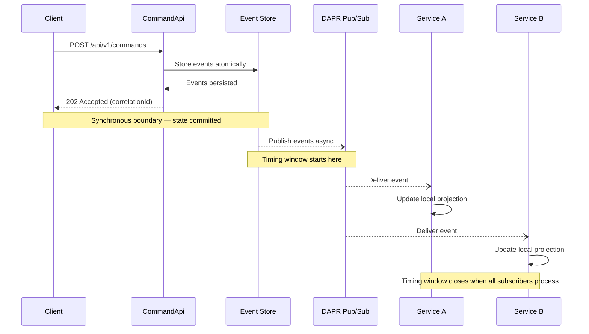

[Back to README](../README.md)

# Cross-Aggregate Timing

How events propagate from command processing to consuming services, the timing window this creates, and how to design for eventual consistency.

## Timing Window

When a tenant command is processed (e.g., `RemoveUserFromTenant`), the event is stored **atomically** in the event store but delivered to subscribers **asynchronously** via DAPR pub/sub. This creates a timing window where:

1. The Tenant aggregate has already applied the state change
2. Subscribing services have **not yet** received or processed the event
3. During this window, a subscribing service's local projection still reflects the old state

Under normal load, the propagation window is typically **50–200ms**. Under pub/sub backpressure or network latency, it can extend to low seconds.

## Event Propagation Flow

The following diagram shows the consumer-facing event propagation flow. The synchronous boundary (atomic store + response) and asynchronous boundary (pub/sub delivery) define the timing window.

## Designing for Eventual Consistency

Subscribing services should treat tenant state as **eventually consistent**. Follow these guidelines:

**Event ordering guarantees:**

- **Within a single aggregate instance**, events are **stored** in strict order — the aggregate version (sequence number) is monotonically increasing. Note that DAPR pub/sub does not guarantee delivery order; events may be redelivered out of sequence. Consumers must resequence using `aggregateVersion`, not delivery order.
- **Across different aggregates** and **across different subscribing services**, there is **no ordering guarantee**. Do not assume events arrive in the same order across different services.

**Design handlers to be idempotent.** DAPR pub/sub guarantees at-least-once delivery, meaning events may arrive more than once. See [Idempotent Event Processing](idempotent-event-processing.md) for patterns.

**Use the query endpoint for read-after-write confirmation.** When a consuming service needs to verify a command was processed before proceeding:

- Query `GET /api/tenants/{id}` to check the current tenant state
- Command responses include the aggregate ID for direct navigation
- Retry with a short backoff if the projection has not caught up

## Phase 2: Synchronous Enforcement

For security-critical scenarios where eventual consistency is insufficient (e.g., rejecting unauthorized commands before they reach any domain service), the **planned EventStore authorization plugin** provides a synchronous enforcement option.

The auth plugin will use a **local projection** of tenant-user-role state to reject unauthorized commands at the MediatR pipeline level, **before** they reach any domain service. This closes the timing window by providing synchronous permission checks.

> **Current status:** The auth plugin is planned for Phase 2. It does not exist yet.

**MVP approach:** Document the timing window, design consuming services for eventual consistency, and use the query endpoint for read-after-write verification when needed.
